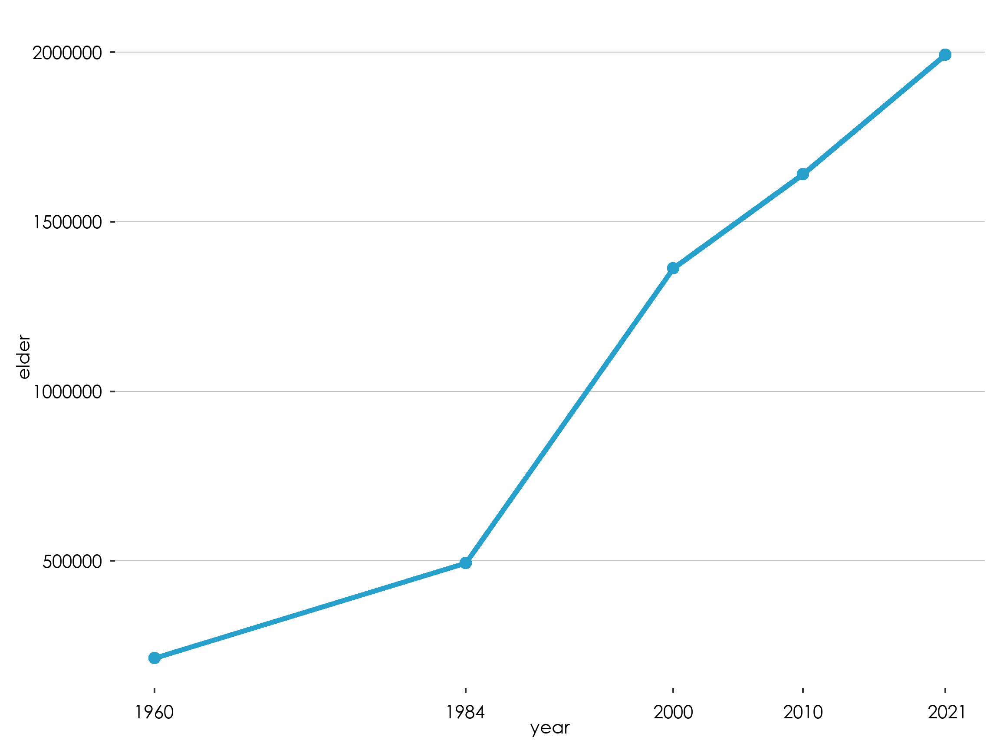
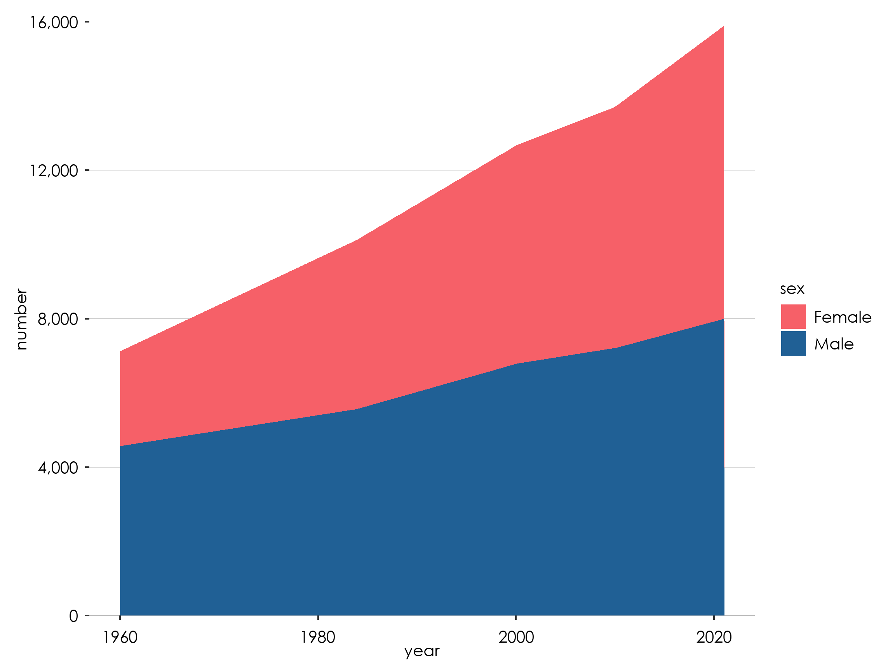
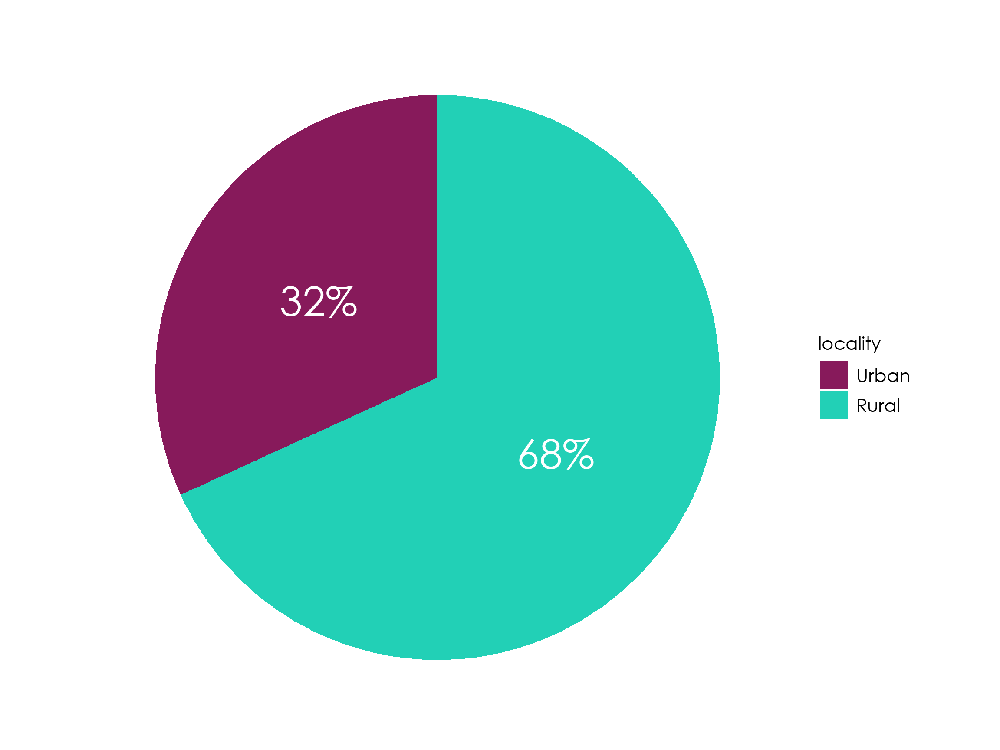

<link rel="stylesheet" href="//fonts.googleapis.com/css?family=Lato" />


R is an amazing tool for data analysis and visualization. The code on this page shows the a variety of plots using the R `ggplot2` package to display statistical outputs. All the data shown on the page is fictitious and only meant for illustrative purposes.


## Use of Fonts 

- Century Gothic Bold, font size 12 should be used for the labels and values on the graph. -   [**Download here**](https://drive.google.com/file/d/1d4p_kZPfMw2Id0yVK3oOJ_SFPYbzQe-2/view?usp=share_link)

## General Rules

- All axes should be labelled and where possible, the values for data points should be indicated on the graph.
- Prevent use of grid lines whenever possible to not clutter plots
- Use line breaks in long labels
- Be conscious about the way axis are ordered. For example, order regions either from the lowest to the highest value or using the serpentine order.
- label axis appropriately


## Use of Colours

Please use the following colour schemes for different types of disaggregation.


#### Sex


```{=html}
<div class="multi-group-container">
                    <div class="color two">
                    <p style="text-align:center">Male</p>
                        <div class="swatch groupcolor male dark">
                            <div class="color-code"><br><br>Hex: #206095 <br>rgb(32, 96, 149)<br>.</div>
                        </div>
                    <svg width="30" height="30" class="print-swatch"><rect width="30" height="30" fill="#1696d2"></rect></svg></div>
                    <div class="color two">
                        <p style="text-align: center">Female</p>
                        <div class="swatch groupcolor female dark">
                            <div class="color-code"><br><br>Hex: #F66068 <br>rgb(246, 96,104)<br>.</div>
                        </div>
                    <svg width="30" height="30" class="print-swatch"><rect width="30" height="30" fill="#000000"></rect></svg></div>
                </div>
    
    <br>
    <br>
```


#### Locality Type


```{=html}
<div class="multi-group-container">
                    <div class="color three">
                         <p style="text-align: center">National</p>  
                        <div class="swatch groupcolor national dark">
                         <div class="color-code"><br><br>#27A0CC <br>.</div>
                        </div>
                    <svg width="30" height="30" class="print-swatch"><rect width="30" height="30" fill="#1696d2"></rect></svg></div>
                    <div class="color three">
                        <p style="text-align: center">Urban</p>
                        <div class="swatch groupcolor urban dark">
                            <div class="color-code"><br><br>#871A5B <br>.</div>
                        </div>
                    <svg width="30" height="30" class="print-swatch"><rect width="30" height="30" fill="#000000"></rect></svg></div>
                            <div class="color three">
                                <p style="text-align: center">Rural</p>
                        <div class="swatch groupcolor rural">
                            
                            <div class="color-code"><br><br>#22D0B6 <br>.</div>
                        </div>
                    <svg width="30" height="30" class="print-swatch"><rect width="30" height="30" fill="#000000"></rect></svg></div>
                </div>
    
    <br>
    <br>
```

<br>

#### Economic Sectors


```{=html}
<div class="multi-group-container">
                    <div class="color three">
                         <p style="text-align: center">Industry</p>  
                        <div class="swatch groupcolor industry dark">
                         <div class="color-code"><br><br>#14607A <br>.</div>
                        </div>
                    <svg width="30" height="30" class="print-swatch"><rect width="30" height="30" fill="#1696d2"></rect></svg></div>
                    <div class="color three">
                        <p style="text-align: center">Agriculture</p>
                        <div class="swatch groupcolor agriculture">
                            <div class="color-code"><br><br>#07BB9E <br>.</div>
                        </div>
                    <svg width="30" height="30" class="print-swatch"><rect width="30" height="30" fill="#000000"></rect></svg></div>
                            <div class="color three">
                                <p style="text-align: center">Service</p>
                        <div class="swatch groupcolor service dark">
                            
                            <div class="color-code"><br><br>#F98B00 <br>.</div>
                        </div>
                    <svg width="30" height="30" class="print-swatch"><rect width="30" height="30" fill="#000000"></rect></svg></div>
                </div>
    
    <br>
    <br>
```

<br>

#### Neutral
Neutral is used on general variables. It is advise that the maximum number of variables per plot should not be more than 5.


```{=html}
<div class="multi-group-container">

                    <div class="colour six">
                        <div class="swatch groupcolor Neutral1 dark">
                            <div class="color-code"><br>#002060</div>
                        </div>
                    <svg width="30" height="30" class="print-swatch"><rect width="30" height="30" fill="#1696d2"></rect></svg></div>
                    <div class="colour six">
                        <div class="swatch groupcolor Neutral2 dark">
                            <div class="color-code"><br>#0070C0</div>
                        </div>
                    <svg width="30" height="30" class="print-swatch"><rect width="30" height="30" fill="#d2d2d2"></rect></svg></div>
                    <div class="colour six">
                        <div class="swatch groupcolor Neutral3 dark">
                            <div class="color-code"><br>#00B0F0</div>
                        </div>
                    <svg width="30" height="30" class="print-swatch"><rect width="30" height="30" fill="#000000"></rect></svg></div>
                    <div class="colour six">
                        <div class="swatch groupcolor Neutral4">
                            <div class="color-code"><br>#8EA9DB</div>
                        </div>
                    <svg width="30" height="30" class="print-swatch"><rect width="30" height="30" fill="#fdbf11"></rect></svg></div>
                    <div class="colour six">
                        <div class="swatch groupcolor Neutral5">
                            <div class="color-code"><br>#9BC2E6</div>
                        </div>
                    <svg width="30" height="30" class="print-swatch"><rect width="30" height="30" fill="#ec008b"></rect></svg></div>
                    <div class="colour six">
                        <div class="swatch groupcolor Neutral6">
                            <div class="color-code"><br>#FFFFCC</div>
                        </div>
                    <svg width="30" height="30" class="print-swatch"><rect width="30" height="30" fill="#55b748"></rect></svg></div>
                    
    </div>
    
    <br>
    <br>
```

<br>

#### Positive \~ Negative


```{=html}
<div class="multi-group-container">

                    <div class="colour five">
                        <div class="swatch groupcolor Positive1">
                            <div class="color-code"><br>#6AA84F</div>
                        </div>
                    <svg width="30" height="30" class="print-swatch"><rect width="30" height="30" fill="#1696d2"></rect></svg></div>
                    <div class="colour five">
                        <div class="swatch groupcolor Positive2">
                            <div class="color-code"><br>#93C47D</div>
                        </div>
                    <svg width="30" height="30" class="print-swatch"><rect width="30" height="30" fill="#d2d2d2"></rect></svg></div>
                    <div class="colour five">
                        <div class="swatch groupcolor Neutral">
                            <div class="color-code"><br>#FFFFCC</div>
                        </div>
                    <svg width="30" height="30" class="print-swatch"><rect width="30" height="30" fill="#000000"></rect></svg></div>
                    <div class="colour five">
                        <div class="swatch groupcolor Negative2">
                            <div class="color-code"><br>#F4CCCC</div>
                        </div>
                    <svg width="30" height="30" class="print-swatch"><rect width="30" height="30" fill="#fdbf11"></rect></svg></div>
                    <div class="colour six">
                        <div class="swatch groupcolor Negative1">
                            <div class="color-code"><br>#E06666</div>
                        </div>
                    <svg width="30" height="30" class="print-swatch"><rect width="30" height="30" fill="#ec008b"></rect></svg></div>
                    
    </div>
    
    <br>
    <br>
```

<br>

#### Population & Density


```{=html}
<div class="multi-group-container">

                    <div class="colour five">
                        <div class="swatch groupcolor pop1">
                            <div class="color-code"><br>#FFFFCC</div>
                        </div>
                    <svg width="30" height="30" class="print-swatch"><rect width="30" height="30" fill="#d2d2d2"></rect></svg></div>
                    <div class="colour five">
                        <div class="swatch groupcolor pop2">
                            <div class="color-code"><br>#C7E9B4</div>
                        </div>
                    <svg width="30" height="30" class="print-swatch"><rect width="30" height="30" fill="#000000"></rect></svg></div>
                    <div class="colour five">
                        <div class="swatch groupcolor pop3">
                            <div class="color-code"><br>#7FCDBB</div>
                        </div>
                    <svg width="30" height="30" class="print-swatch"><rect width="30" height="30" fill="#fdbf11"></rect></svg></div>
                    <div class="colour five">
                        <div class="swatch groupcolor pop4 dark">
                            <div class="color-code"><br>#41B6C4</div>
                        </div>
                    <svg width="30" height="30" class="print-swatch"><rect width="30" height="30" fill="#ec008b"></rect></svg></div>
                    <div class="colour five">
                        <div class="swatch groupcolor pop5 dark">
                            <div class="color-code"><br>#2C7FB8</div>
                        </div>
                    <svg width="30" height="30" class="print-swatch"><rect width="30" height="30" fill="#55b748"></rect></svg></div>
                    
    </div>
    
    <br>
    <br>
```

<br>

#### Incidence


```{=html}
<div class="multi-group-container">

                    <div class="colour six">
                        <div class="swatch groupcolor inci1">
                            <div class="color-code"><br>#FECCCC</div>
                        </div>
                    <svg width="30" height="30" class="print-swatch"><rect width="30" height="30" fill="#d2d2d2"></rect></svg></div>
                    
     <div class="colour six">
                        <div class="swatch groupcolor inci2">
                            <div class="color-code"><br>#FF9999</div>
                        </div>
                    <svg width="30" height="30" class="print-swatch"><rect width="30" height="30" fill="#000000"></rect></svg></div>
                    
     <div class="colour six">
                        <div class="swatch groupcolor inci3 dark">
                            <div class="color-code"><br>#FF6666</div>
                        </div>
                    <svg width="30" height="30" class="print-swatch"><rect width="30" height="30" fill="#fdbf11"></rect></svg></div>
                   
     <div class="colour six">
                        <div class="swatch groupcolor inci4 dark">
                            <div class="color-code"><br>#FF3333</div>
                        </div>
                    <svg width="30" height="30" class="print-swatch"><rect width="30" height="30" fill="#ec008b"></rect></svg></div>
                   
     <div class="colour six">
                        <div class="swatch groupcolor inci5 dark">
                            <div class="color-code"><br>#CC0000</div>
                        </div>
                    <svg width="30" height="30" class="print-swatch"><rect width="30" height="30" fill="#55b748"></rect></svg></div>
     
     <div class="colour six">
                        <div class="swatch groupcolor inci6 dark">
                            <div class="color-code"><br>#990000</div>
                        </div>
                    <svg width="30" height="30" class="print-swatch"><rect width="30" height="30" fill="#55b748"></rect></svg></div>
                    
    </div>
    
    <br>
    <br>
```

<br>

#### Food / Non-food


```{=html}
<div class="multi-group-container">
                    <div class="color two">
                    <p style="text-align:center">Food</p>
                        <div class="swatch groupcolor food">
                            <div class="color-code"><br>#3ECDB9 <br></div>
                        </div>
                    <svg width="30" height="30" class="print-swatch"><rect width="30" height="30" fill="#1696d2"></rect></svg></div>
                    <div class="color two">
                        <p style="text-align: center">Non-food</p>
                        <div class="swatch groupcolor nonfood">
                            <div class="color-code"><br>#04BCFC<br></div>
                        </div>
                    <svg width="30" height="30" class="print-swatch"><rect width="30" height="30" fill="#000000"></rect></svg></div>
                </div>
    
    <br>
    <br>
```

<br>

# Using GSS theme

In the future, GSS will release it is own package for data visualizations. For now it suffices to run this code to load the all the R code to set the right defaults (colours, fonts, etc.) to create plots in the GGS theme.


::: {.cell}

```{.r .cell-code}
# load packages
library(ggplot2)
library(tidyverse)
library(ggtext)
library(gghighlight)
library(sysfonts)
library(showtextdb)
library(showtext)
library(glue)
library(scales)
library(kableExtra)
library(patchwork)
library(forcats)
library(tidyverse)
library(ggbump)
library(reshape2)
library(plotly)


# load the font
font_add("century gothic bold", "Font/Century Gothic.ttf")

# make sure ggplot recognizes the font 
# and set the font to high-res
showtext_auto()
showtext::showtext_opts(dpi = 300)

# set default colour for plots with multiple categories
options(ggplot2.discrete.colour = c("#210D69", "#DB2E76", "#586889", "#227C42"))
options(ggplot2.discrete.fill   = c("#210D69", "#DB2E76", "#586889", "#227C42"))

# set default colour for plots with a single category
update_geom_defaults("bar",   list(fill = "#27A0CC"))
update_geom_defaults("col",   list(fill = "#27A0CC"))

# update the font to show in geom_text()
update_geom_defaults("text",   list(family = "century gothic bold", size = 4.5 ))
GSS_font <- "century gothic bold"
# create a GGS theme based on the theme_gray()
gssthemes<-function(){
  theme_gray() %+replace%
    theme(
      text=element_text(family = "century gothic bold",
                        colour="black",
                        size=10),
      plot.margin = margin(0.5,0.3, 0.3, 0.3, "cm"),
      # plot.title =element_textbox_simple(family="century gothic bold", size=16,
      #                                    lineheight=1,
      #                                    margin=margin(b=10)),
      # plot.title.position="plot",
      plot.caption=element_markdown(hjust=0, color="gray",
                                    lineheight=1.5,
                                    margin =margin(t=10)),
      plot.caption.position="plot",
      axis.title.y=element_text(color="black", angle=90, size = 10),
      axis.title.x=element_text(color="black",size = 10),
      axis.text.x=element_text(color="black", size = 10, vjust = 0, margin = margin(t = 5, r = 5, b = 0, l = 0, unit = "pt")),
      axis.text.y=element_text(color="black", size = 10, hjust = 1, margin = margin(t = 5, r = 5, b = 0, l = 0, unit = "pt")),
      legend.text=element_text(color="black",  size = 10),
      panel.grid.major.y=element_line(color="gray", size=0.25),
      panel.grid.major.x=element_blank(),
      panel.grid.minor=element_blank(),
      panel.background=element_rect(fill="white", color=NA),
      plot.background=element_rect(fill="white", color=NA),
      legend.background=element_rect(fill="white", color=NA),
     strip.background =element_rect(fill="white",  color=NA),
     legend.key = element_rect(fill = "white", color = NA), 
     strip.text = element_text( size = 20,  margin = margin(t = 5, r = 0, b = 10, l = 0, unit = "pt"))
    )
}

# this will make the labels of the bar chart a bit nicer, by ending above the highest data point
nicelimits <- function(x) {
  range(scales::extended_breaks(only.loose = TRUE)(x))
}


# Define color palette

statscolours_color_scheme  <- c("#382873", "#0168C8", "#00B050")

#locality
national_color <- "#27A0CC"
urban_color <- "#871A5B"
rural_color <- "#22D0B6"
urbanrural_color_scheme  <- c("#27A0CC", "#871A5B", "#22D0B6")

#Sex
male_color <- "#206095"
female_color <- "#F66068"
malefemale_color_scheme <- c("#27A0CC", "#206095", "#F66068")

#positive/negative
negative_color <- "#cc3333"
positive_color <- "#33cccc"

#pallete
neutral_color_scheme  <- c("#002060", "#0070C0", "#00B0F0", "#8EA9DB", "#9BC2E6", "#FFFFCC")
posneg_color_scheme  <- c("#38761D","#6AA84F","#93C47D","#F4CCCC","#E06666","#990000")
posneutralneg_color_scheme  <- c("#38761D","#6AA84F","#FFFFCC","#E06666","#990000")
population_color_scheme  <- c("#FFFFCC","#C7E9B4","#7FCDBB","#41B6C4","#2C7FB8")
incidence_color_scheme  <- c("#FECCCC","#FF9999","#FF6666","#FF3333","#CC0000","#990000")


#Economic sector colour
industry_color<-"#14607A"
agric_color<-"#07BB9E"
services_color<-"#F98B00"
economic_sectors<- c("#14607A","#07BB9E","#F98B00")

#food
food_colour<- "#3ECDB9"
nonfood_colour<-"#04BCFC"
```
:::


## Bar charts

A bar chart is an effective way to visually represent data that is categorical or discrete in nature for example different regions in Ghana). It is particularly useful when comparing values across different categories or groups. Bar charts are ideal for showing the distribution or frequency of data, as well as identifying trends or patterns over time. They can be used to display numerical data such as quantities, percentages, and proportions. Overall, a bar chart is appropriate when you want to easily compare different categories or groups and understand the relative differences between them.


### example data


::: {.cell}

```{.r .cell-code}
n_chopbars_df  <- tribble(~region_number, ~region, ~number_of_chop_bars, ~urban, ~rural,
                            1,"Western", 567, 300, 267,
                            2, "Central", 907, 600, 307,
                            3, "Greater Accra", 6990, 4792, 2198, 
                            4, "Volta", 278, 78, 200, 
                            5, "Eastern", 787, 287, 500,
                            6, "Ashanti",5621, 621, 5000,
                            7, "Western North", 345, 145, 200,
                            8,	"Ahafo", 678, 339, 339,
                            9, "Bono",1268, 600, 668, 
                            10,"Bono East", 1268,1048, 220,
                            11,"Oti",773, 500, 273, 
                            12,"Northern", 112, 12, 100,
                            13,"Savannah", 1289,503, 786, 
                            14,"North East",378, 142, 236,
                            15,"Upper East",1279,326, 953, 
                            16,	"Upper West", 3782, 3456, 326) 

n_chopbars_df %>%
	kable() %>%
	kable_styling() %>% 
  scroll_box(height = "400px")
```

::: {.cell-output-display}
`````{=html}
<div style="border: 1px solid #ddd; padding: 0px; overflow-y: scroll; height:400px; "><table class="table table-striped table-hover table-condensed table-responsive" style="margin-left: auto; margin-right: auto;">
 <thead>
  <tr>
   <th style="text-align:right;position: sticky; top:0; background-color: #FFFFFF;"> region_number </th>
   <th style="text-align:left;position: sticky; top:0; background-color: #FFFFFF;"> region </th>
   <th style="text-align:right;position: sticky; top:0; background-color: #FFFFFF;"> number_of_chop_bars </th>
   <th style="text-align:right;position: sticky; top:0; background-color: #FFFFFF;"> urban </th>
   <th style="text-align:right;position: sticky; top:0; background-color: #FFFFFF;"> rural </th>
  </tr>
 </thead>
<tbody>
  <tr>
   <td style="text-align:right;"> 1 </td>
   <td style="text-align:left;"> Western </td>
   <td style="text-align:right;"> 567 </td>
   <td style="text-align:right;"> 300 </td>
   <td style="text-align:right;"> 267 </td>
  </tr>
  <tr>
   <td style="text-align:right;"> 2 </td>
   <td style="text-align:left;"> Central </td>
   <td style="text-align:right;"> 907 </td>
   <td style="text-align:right;"> 600 </td>
   <td style="text-align:right;"> 307 </td>
  </tr>
  <tr>
   <td style="text-align:right;"> 3 </td>
   <td style="text-align:left;"> Greater Accra </td>
   <td style="text-align:right;"> 6990 </td>
   <td style="text-align:right;"> 4792 </td>
   <td style="text-align:right;"> 2198 </td>
  </tr>
  <tr>
   <td style="text-align:right;"> 4 </td>
   <td style="text-align:left;"> Volta </td>
   <td style="text-align:right;"> 278 </td>
   <td style="text-align:right;"> 78 </td>
   <td style="text-align:right;"> 200 </td>
  </tr>
  <tr>
   <td style="text-align:right;"> 5 </td>
   <td style="text-align:left;"> Eastern </td>
   <td style="text-align:right;"> 787 </td>
   <td style="text-align:right;"> 287 </td>
   <td style="text-align:right;"> 500 </td>
  </tr>
  <tr>
   <td style="text-align:right;"> 6 </td>
   <td style="text-align:left;"> Ashanti </td>
   <td style="text-align:right;"> 5621 </td>
   <td style="text-align:right;"> 621 </td>
   <td style="text-align:right;"> 5000 </td>
  </tr>
  <tr>
   <td style="text-align:right;"> 7 </td>
   <td style="text-align:left;"> Western North </td>
   <td style="text-align:right;"> 345 </td>
   <td style="text-align:right;"> 145 </td>
   <td style="text-align:right;"> 200 </td>
  </tr>
  <tr>
   <td style="text-align:right;"> 8 </td>
   <td style="text-align:left;"> Ahafo </td>
   <td style="text-align:right;"> 678 </td>
   <td style="text-align:right;"> 339 </td>
   <td style="text-align:right;"> 339 </td>
  </tr>
  <tr>
   <td style="text-align:right;"> 9 </td>
   <td style="text-align:left;"> Bono </td>
   <td style="text-align:right;"> 1268 </td>
   <td style="text-align:right;"> 600 </td>
   <td style="text-align:right;"> 668 </td>
  </tr>
  <tr>
   <td style="text-align:right;"> 10 </td>
   <td style="text-align:left;"> Bono East </td>
   <td style="text-align:right;"> 1268 </td>
   <td style="text-align:right;"> 1048 </td>
   <td style="text-align:right;"> 220 </td>
  </tr>
  <tr>
   <td style="text-align:right;"> 11 </td>
   <td style="text-align:left;"> Oti </td>
   <td style="text-align:right;"> 773 </td>
   <td style="text-align:right;"> 500 </td>
   <td style="text-align:right;"> 273 </td>
  </tr>
  <tr>
   <td style="text-align:right;"> 12 </td>
   <td style="text-align:left;"> Northern </td>
   <td style="text-align:right;"> 112 </td>
   <td style="text-align:right;"> 12 </td>
   <td style="text-align:right;"> 100 </td>
  </tr>
  <tr>
   <td style="text-align:right;"> 13 </td>
   <td style="text-align:left;"> Savannah </td>
   <td style="text-align:right;"> 1289 </td>
   <td style="text-align:right;"> 503 </td>
   <td style="text-align:right;"> 786 </td>
  </tr>
  <tr>
   <td style="text-align:right;"> 14 </td>
   <td style="text-align:left;"> North East </td>
   <td style="text-align:right;"> 378 </td>
   <td style="text-align:right;"> 142 </td>
   <td style="text-align:right;"> 236 </td>
  </tr>
  <tr>
   <td style="text-align:right;"> 15 </td>
   <td style="text-align:left;"> Upper East </td>
   <td style="text-align:right;"> 1279 </td>
   <td style="text-align:right;"> 326 </td>
   <td style="text-align:right;"> 953 </td>
  </tr>
  <tr>
   <td style="text-align:right;"> 16 </td>
   <td style="text-align:left;"> Upper West </td>
   <td style="text-align:right;"> 3782 </td>
   <td style="text-align:right;"> 3456 </td>
   <td style="text-align:right;"> 326 </td>
  </tr>
</tbody>
</table></div>

`````
:::
:::


### One Color


::: {.cell}

```{.r .cell-code}
# Pipe operator to pass data frame to the next line
n_chopbars_df %>% 
  # Create a ggplot object and set the aesthetic mappings
  ggplot(mapping = aes(x = region, y = number_of_chop_bars)) +
  # Add a column chart with bars of equal width
  geom_col(width = 0.8) +
  # Apply a custom theme to the plot
  gssthemes() +
# The expand argument controls whether the range of the y-axis is expanded to include a small margin around the data. The limits argument sets the upper and lower limits of the y-axis to nicelimits, which is a function that makes sure the limits are always above the largest data point. he breaks argument sets the tick marks on the y-axis to use extended_breaks from the scales package, which generates a sequence of evenly spaced values with loose spacing.
  scale_y_continuous( expand = c( 0, 1 ),
                      limits = nicelimits,
  										labels = scales::comma,
                      breaks = scales::extended_breaks(only.loose = TRUE)) +
	# Set the scale for the x-axis with tick labels rotated by 90 degrees
  scale_x_discrete(guide = guide_axis(angle = 90)) +
	 # Add axis labels to the plot
	labs(x = NULL,
			 y = "number of chop bars")+
	# Set the coordinate system for the plot, allowing data points to be partially displayed outside of the plot area.
  coord_cartesian(clip = "off")
```

::: {.cell-output-display}
{width=768}
:::
:::


### One Color (Rotated) with labels 

This example introduces `coord_flip()` instead of `coord_cartesian()` and bring back some theme elements to draw vertical instead of horizontal grid lines. 


::: {.cell}

```{.r .cell-code}
# Pipe operator to pass data frame to the next line
n_chopbars_df %>% 
  # Create a ggplot object and set the aesthetic mappings
  ggplot(mapping = aes(x = region, y = number_of_chop_bars)) +
  # Add a column chart with bars of equal width
  geom_col(width = 0.8) +
	# add text to the end of the plot
	 geom_text(mapping = aes(label = number_of_chop_bars), hjust = -0.2) +
  # Apply a custom theme to the plot
  gssthemes() +
	# The expand argument controls whether the range of the y-axis is expanded to include a small margin around the data. 
	# The limits argument sets the upper and lower limits of the y-axis to nicelimits, which is a function that makes sure 
	# the limits are always above the largest data point. he breaks argument sets the tick marks on the y-axis to use
	# extended_breaks from the scales package, which generates a sequence of evenly spaced values with loose spacing.
  scale_y_continuous( expand = c( 0, 1 ),
                      limits = nicelimits,
  										labels = scales::comma,
                      breaks = scales::extended_breaks(only.loose = TRUE)) +
	# Add axis labels to the plot
	labs(x = NULL,
			 y = "number of chop bars")+
	# Set the coordinate system for the plot, allowing data points to be partially displayed outside of the plot area.
  coord_flip(clip = "off") +
	# change the theme a bit so that 1) the axis lines are vertical and 2) the labels are right alligend
	theme(panel.grid.major.x=element_line(color = "gray", size=0.25),
				panel.grid.major.y=element_blank(),
				axis.text.x = element_text(vjust = 0.5))
```

::: {.cell-output-display}
{width=768}
:::
:::


### One Color (Rotated) with labels and ordered

You can use the `reorder()` function to order the axis labels.


::: {.cell}

```{.r .cell-code}
# Pipe operator to pass data frame to the next line
n_chopbars_df %>% 
  # Create a ggplot object and set the aesthetic mappings
	# use the reorder function to reorder the the bars
  ggplot(mapping = aes(x = reorder(region,number_of_chop_bars), y = number_of_chop_bars)) +
  # Add a column chart with bars of equal width
  geom_col(width = 0.8) +
	# add text to the end of the plot, and comma at all thousands
	 geom_text(mapping = aes(label = scales::comma(number_of_chop_bars)), hjust = -0.2,) +
  # Apply a custom theme to the plot
  gssthemes() +
	# The expand argument controls whether the range of the y-axis is expanded to include a small margin around the data. 
	# The limits argument sets the upper and lower limits of the y-axis to nicelimits, which is a function that makes sure 
	# the limits are always above the largest data point. he breaks argument sets the tick marks on the y-axis to use
	# extended_breaks from the scales package, which generates a sequence of evenly spaced values with loose spacing.
  scale_y_continuous( expand = c( 0, 1 ),
                      limits = nicelimits,
  										labels = scales::comma,
                      breaks = scales::extended_breaks(only.loose = TRUE)) +
	# Add axis labels to the plot
	labs(x = NULL,
			 y = "number of chop bars")+
	# Set the coordinate system for the plot, allowing data points to be partially displayed outside of the plot area.
  coord_flip(clip = "off") +
	# change the theme a bit so that 1) the axis lines are vertical and 2) the labels are right alligend
	theme(panel.grid.major.x=element_line(color = "gray", size=0.25),
				panel.grid.major.y=element_blank(),
				axis.text.x = element_text(vjust = 0.5))
```

::: {.cell-output-display}
{width=768}
:::
:::


### Show different categories using color palettes (stacked)

If you want to show different categories, you can use the `fill = categorical variable` argument inside the aesthetics mapping. To do this, the data needs to be in a long format

#### example data (long format)


::: {.cell}

```{.r .cell-code}
n_chopbars_df_longformat <- n_chopbars_df %>% 
	select(-number_of_chop_bars ) %>% 
	pivot_longer(-c(region_number, region), names_to = "locality", values_to = "number_of_chop_bars")

n_chopbars_df_longformat %>%
	kable() %>%
	kable_styling() %>% 
  scroll_box(height = "400px")
```

::: {.cell-output-display}
`````{=html}
<div style="border: 1px solid #ddd; padding: 0px; overflow-y: scroll; height:400px; "><table class="table table-striped table-hover table-condensed table-responsive" style="margin-left: auto; margin-right: auto;">
 <thead>
  <tr>
   <th style="text-align:right;position: sticky; top:0; background-color: #FFFFFF;"> region_number </th>
   <th style="text-align:left;position: sticky; top:0; background-color: #FFFFFF;"> region </th>
   <th style="text-align:left;position: sticky; top:0; background-color: #FFFFFF;"> locality </th>
   <th style="text-align:right;position: sticky; top:0; background-color: #FFFFFF;"> number_of_chop_bars </th>
  </tr>
 </thead>
<tbody>
  <tr>
   <td style="text-align:right;"> 1 </td>
   <td style="text-align:left;"> Western </td>
   <td style="text-align:left;"> urban </td>
   <td style="text-align:right;"> 300 </td>
  </tr>
  <tr>
   <td style="text-align:right;"> 1 </td>
   <td style="text-align:left;"> Western </td>
   <td style="text-align:left;"> rural </td>
   <td style="text-align:right;"> 267 </td>
  </tr>
  <tr>
   <td style="text-align:right;"> 2 </td>
   <td style="text-align:left;"> Central </td>
   <td style="text-align:left;"> urban </td>
   <td style="text-align:right;"> 600 </td>
  </tr>
  <tr>
   <td style="text-align:right;"> 2 </td>
   <td style="text-align:left;"> Central </td>
   <td style="text-align:left;"> rural </td>
   <td style="text-align:right;"> 307 </td>
  </tr>
  <tr>
   <td style="text-align:right;"> 3 </td>
   <td style="text-align:left;"> Greater Accra </td>
   <td style="text-align:left;"> urban </td>
   <td style="text-align:right;"> 4792 </td>
  </tr>
  <tr>
   <td style="text-align:right;"> 3 </td>
   <td style="text-align:left;"> Greater Accra </td>
   <td style="text-align:left;"> rural </td>
   <td style="text-align:right;"> 2198 </td>
  </tr>
  <tr>
   <td style="text-align:right;"> 4 </td>
   <td style="text-align:left;"> Volta </td>
   <td style="text-align:left;"> urban </td>
   <td style="text-align:right;"> 78 </td>
  </tr>
  <tr>
   <td style="text-align:right;"> 4 </td>
   <td style="text-align:left;"> Volta </td>
   <td style="text-align:left;"> rural </td>
   <td style="text-align:right;"> 200 </td>
  </tr>
  <tr>
   <td style="text-align:right;"> 5 </td>
   <td style="text-align:left;"> Eastern </td>
   <td style="text-align:left;"> urban </td>
   <td style="text-align:right;"> 287 </td>
  </tr>
  <tr>
   <td style="text-align:right;"> 5 </td>
   <td style="text-align:left;"> Eastern </td>
   <td style="text-align:left;"> rural </td>
   <td style="text-align:right;"> 500 </td>
  </tr>
  <tr>
   <td style="text-align:right;"> 6 </td>
   <td style="text-align:left;"> Ashanti </td>
   <td style="text-align:left;"> urban </td>
   <td style="text-align:right;"> 621 </td>
  </tr>
  <tr>
   <td style="text-align:right;"> 6 </td>
   <td style="text-align:left;"> Ashanti </td>
   <td style="text-align:left;"> rural </td>
   <td style="text-align:right;"> 5000 </td>
  </tr>
  <tr>
   <td style="text-align:right;"> 7 </td>
   <td style="text-align:left;"> Western North </td>
   <td style="text-align:left;"> urban </td>
   <td style="text-align:right;"> 145 </td>
  </tr>
  <tr>
   <td style="text-align:right;"> 7 </td>
   <td style="text-align:left;"> Western North </td>
   <td style="text-align:left;"> rural </td>
   <td style="text-align:right;"> 200 </td>
  </tr>
  <tr>
   <td style="text-align:right;"> 8 </td>
   <td style="text-align:left;"> Ahafo </td>
   <td style="text-align:left;"> urban </td>
   <td style="text-align:right;"> 339 </td>
  </tr>
  <tr>
   <td style="text-align:right;"> 8 </td>
   <td style="text-align:left;"> Ahafo </td>
   <td style="text-align:left;"> rural </td>
   <td style="text-align:right;"> 339 </td>
  </tr>
  <tr>
   <td style="text-align:right;"> 9 </td>
   <td style="text-align:left;"> Bono </td>
   <td style="text-align:left;"> urban </td>
   <td style="text-align:right;"> 600 </td>
  </tr>
  <tr>
   <td style="text-align:right;"> 9 </td>
   <td style="text-align:left;"> Bono </td>
   <td style="text-align:left;"> rural </td>
   <td style="text-align:right;"> 668 </td>
  </tr>
  <tr>
   <td style="text-align:right;"> 10 </td>
   <td style="text-align:left;"> Bono East </td>
   <td style="text-align:left;"> urban </td>
   <td style="text-align:right;"> 1048 </td>
  </tr>
  <tr>
   <td style="text-align:right;"> 10 </td>
   <td style="text-align:left;"> Bono East </td>
   <td style="text-align:left;"> rural </td>
   <td style="text-align:right;"> 220 </td>
  </tr>
  <tr>
   <td style="text-align:right;"> 11 </td>
   <td style="text-align:left;"> Oti </td>
   <td style="text-align:left;"> urban </td>
   <td style="text-align:right;"> 500 </td>
  </tr>
  <tr>
   <td style="text-align:right;"> 11 </td>
   <td style="text-align:left;"> Oti </td>
   <td style="text-align:left;"> rural </td>
   <td style="text-align:right;"> 273 </td>
  </tr>
  <tr>
   <td style="text-align:right;"> 12 </td>
   <td style="text-align:left;"> Northern </td>
   <td style="text-align:left;"> urban </td>
   <td style="text-align:right;"> 12 </td>
  </tr>
  <tr>
   <td style="text-align:right;"> 12 </td>
   <td style="text-align:left;"> Northern </td>
   <td style="text-align:left;"> rural </td>
   <td style="text-align:right;"> 100 </td>
  </tr>
  <tr>
   <td style="text-align:right;"> 13 </td>
   <td style="text-align:left;"> Savannah </td>
   <td style="text-align:left;"> urban </td>
   <td style="text-align:right;"> 503 </td>
  </tr>
  <tr>
   <td style="text-align:right;"> 13 </td>
   <td style="text-align:left;"> Savannah </td>
   <td style="text-align:left;"> rural </td>
   <td style="text-align:right;"> 786 </td>
  </tr>
  <tr>
   <td style="text-align:right;"> 14 </td>
   <td style="text-align:left;"> North East </td>
   <td style="text-align:left;"> urban </td>
   <td style="text-align:right;"> 142 </td>
  </tr>
  <tr>
   <td style="text-align:right;"> 14 </td>
   <td style="text-align:left;"> North East </td>
   <td style="text-align:left;"> rural </td>
   <td style="text-align:right;"> 236 </td>
  </tr>
  <tr>
   <td style="text-align:right;"> 15 </td>
   <td style="text-align:left;"> Upper East </td>
   <td style="text-align:left;"> urban </td>
   <td style="text-align:right;"> 326 </td>
  </tr>
  <tr>
   <td style="text-align:right;"> 15 </td>
   <td style="text-align:left;"> Upper East </td>
   <td style="text-align:left;"> rural </td>
   <td style="text-align:right;"> 953 </td>
  </tr>
  <tr>
   <td style="text-align:right;"> 16 </td>
   <td style="text-align:left;"> Upper West </td>
   <td style="text-align:left;"> urban </td>
   <td style="text-align:right;"> 3456 </td>
  </tr>
  <tr>
   <td style="text-align:right;"> 16 </td>
   <td style="text-align:left;"> Upper West </td>
   <td style="text-align:left;"> rural </td>
   <td style="text-align:right;"> 326 </td>
  </tr>
</tbody>
</table></div>

`````
:::
:::

::: {.cell}

```{.r .cell-code}
n_chopbars_df_longformat %>% 
  ggplot(mapping = aes(x = reorder(region,number_of_chop_bars), fill = locality ,  y = number_of_chop_bars)) +
  geom_col(width = 0.8) +
  gssthemes() +
  scale_y_continuous( expand = c( 0, 1 ),
                      limits = nicelimits,
  										labels = scales::comma,
                      breaks = scales::extended_breaks(only.loose = TRUE)) +
	labs(x = NULL,
			 y = "number of chop bars")+
  coord_flip(clip = "off") +
	scale_fill_manual(values = c(urban = urban_color,
															 rural = rural_color))+
	theme(panel.grid.major.x=element_line(color = "gray", size=0.25),
				panel.grid.major.y=element_blank(),
				axis.text.x = element_text(vjust = 0.5))
```

::: {.cell-output-display}
{width=768}
:::
:::


### Show different categories using color palettes (dodged)

Instead of having the categories stacked, you can put them next to each other (stacked)


::: {.cell}

```{.r .cell-code}
n_chopbars_df_longformat %>% 
  ggplot(mapping = aes(x = reorder(region,number_of_chop_bars), fill = locality ,  y = number_of_chop_bars)) +
  geom_col(width = 0.8, position = "dodge") +
	geom_text(mapping = aes(label = scales::comma(number_of_chop_bars)), hjust = -0.2, 
						position = position_dodge(width = 0.8)) +
  gssthemes() +
  scale_y_continuous( expand = c( 0, 0 ),
                      limits = nicelimits,
  										labels = scales::comma,
                      breaks = scales::extended_breaks(only.loose = TRUE)) +
	labs(x = NULL,
			 y = "number of chop bars")+
  coord_flip(clip = "off") +
	scale_fill_manual(values = c(urban = urban_color,
															 rural = rural_color))+
	theme(panel.grid.major.x=element_line(color = "gray", size=0.25),
				panel.grid.major.y=element_blank(),
				axis.text.x = element_text(vjust = 0.5))
```

::: {.cell-output-display}
{width=768}
:::
:::


### Bar chart with highlighted category

Sometimes you might want to highlight a single category in a bar chart (for example the National/Ghana average). To highlight also the axis label you need to use the `showtext` package. It is recommended to put highlight is a similar hue than the other colours. This can be done, using the `muted()` function from the `scales` package


::: {.cell}

```{.r .cell-code}
# this code add the Ghana average
n_chopbars_df_with_national <- n_chopbars_df %>% 
	add_row( region_number = 0,
						 region  = "Ghana",
						 number_of_chop_bars = mean(n_chopbars_df$number_of_chop_bars),
						 urban = mean(n_chopbars_df$urban ),
						 rural= mean(n_chopbars_df$rural) )
```
:::

::: {.cell}

```{.r .cell-code}
highlight = function(x, pat, color="black", family="") {
	ifelse(grepl(pat, x), glue("<b style='font-family:{family}; color:{color}'>{x}</b>"), x)
}

# Pipe operator to pass data frame to the next line
n_chopbars_df_with_national %>% 
	mutate(highlight = region == "Ghana") %>% 
  # Create a ggplot object and set the aesthetic mappings
	# use the reorder function to reorder the the bars
  ggplot(mapping = aes(x = reorder(region,number_of_chop_bars), 
  										 y = number_of_chop_bars,
  										  fill = highlight)) +
  geom_col(width = 0.8) +
	geom_text(mapping = aes(label = scales::comma(number_of_chop_bars)), hjust = -0.2) +
  gssthemes() +
  scale_y_continuous( expand = c( 0, 0 ),
                      limits = nicelimits,
  										labels = scales::comma,
                      breaks = scales::extended_breaks(only.loose = TRUE)) +
	scale_x_discrete(labels= function(x) highlight(x, "Ghana", "black")) +
	scale_fill_manual(values = c(`FALSE` = national_color, 
															 `TRUE` = scales::muted(national_color)),
										guide = "none") +
	labs(x = NULL,
			 y = "number of chop bars" )+
  coord_flip(clip = "off") +
	theme(panel.grid.major.x = element_line(color = "gray", size=0.25),
				panel.grid.major.y = element_blank(),
				axis.text.x = element_text(vjust = 0.5),
				axis.text.y = element_markdown()) # to make this work you need to make the y axis a markdown format
```

::: {.cell-output-display}
{width=768}
:::
:::


### Bar chart with long labels

To allow for sufficient plotting space, it is a good idea to add line break to long value labels on the axes. You can use the `str_wrap()` function to add line breaks

#### example data (long labels)


::: {.cell}

```{.r .cell-code}
n_chopbars_df_long_labels  <- tribble(~question, ~count, 
																			"number of households eating at chopbars every day", 678,
																			"number of male headed households eating at chopbars once a week", 1267,
																			"number of female headed households eating at chop bars once a week", 1876)
n_chopbars_df_long_labels %>%
	kable() %>%
	kable_styling()
```

::: {.cell-output-display}
`````{=html}
<table class="table table-striped table-hover table-condensed table-responsive" style="margin-left: auto; margin-right: auto;">
 <thead>
  <tr>
   <th style="text-align:left;"> question </th>
   <th style="text-align:right;"> count </th>
  </tr>
 </thead>
<tbody>
  <tr>
   <td style="text-align:left;"> number of households eating at chopbars every day </td>
   <td style="text-align:right;"> 678 </td>
  </tr>
  <tr>
   <td style="text-align:left;"> number of male headed households eating at chopbars once a week </td>
   <td style="text-align:right;"> 1267 </td>
  </tr>
  <tr>
   <td style="text-align:left;"> number of female headed households eating at chop bars once a week </td>
   <td style="text-align:right;"> 1876 </td>
  </tr>
</tbody>
</table>

`````
:::
:::

::: {.cell}

```{.r .cell-code}
n_chopbars_df_long_labels %>% 
  ggplot(mapping = aes(x = str_wrap(question, 20), y = count)) +
  geom_col(width = 0.8) +
	geom_text(mapping = aes(label = scales::comma(count)), hjust = -0.2) +
  gssthemes() +
  scale_y_continuous( expand = c( 0, 1 ),
                      limits = nicelimits,
  										labels = scales::comma,
                      breaks = scales::extended_breaks(only.loose = TRUE)) +
	labs(x = NULL,
			 y = "number of chop bars")+
  coord_flip(clip = "off") +
	theme(panel.grid.major.x=element_line(color = "gray", size=0.25),
				panel.grid.major.y=element_blank())
```

::: {.cell-output-display}
{width=768}
:::
:::


### Diverging Bar chart

A diverging bar chart is a type of data visualization that displays values of a quantitative variable across two or more categories, where the bars are centered on a common baseline or a central axis. This type of chart is particularly useful for comparing differences in values that can have both positive and negative magnitudes, or when illustrating a relationship between two opposing factors or sentiments.

In a diverging bar chart, the bars extend in opposite directions from the central axis, creating a symmetrical pattern. This layout makes it easy to see the differences between categories and to identify patterns and trends within the data.

When choosing a diverging bar chart, make sure it is appropriate for your dataset and the type of information you want to convey. It is important to note that diverging bar charts may not be suitable for all types of data, especially if the differences between categories are not symmetrical or if the data has no clear central point. In such cases, other visualization methods, like standard bar charts or line charts, might be more suitable.


#### example data (positive and negative values)


::: {.cell}

```{.r .cell-code}
change_in_chop_bars_df <- tribble(~region_number, ~region, ~change,
                            1,"Western", -.35, 
                            2, "Central", -.26, 
                            3, "Greater Accra", .67,
                            4, "Volta", -.18, 
                            5, "Eastern", .47, 
                            6, "Ashanti",.56, 
                            7, "Western North", -.2,
                            8,	"Ahafo", .61, 
                            9, "Bono",.12,
                            10,"Bono East", 0.01,
                            11,"Oti",.07,
                            12,"Northern", .11,
                            13,"Savannah", .12,
                            14,"North East",-.31,
                            15,"Upper East",0,
                            16,	"Upper West", .265)

change_in_chop_bars_df %>% 
	kable() %>%
	kable_styling() %>% 
  scroll_box(height = "400px")
```

::: {.cell-output-display}
`````{=html}
<div style="border: 1px solid #ddd; padding: 0px; overflow-y: scroll; height:400px; "><table class="table table-striped table-hover table-condensed table-responsive" style="margin-left: auto; margin-right: auto;">
 <thead>
  <tr>
   <th style="text-align:right;position: sticky; top:0; background-color: #FFFFFF;"> region_number </th>
   <th style="text-align:left;position: sticky; top:0; background-color: #FFFFFF;"> region </th>
   <th style="text-align:right;position: sticky; top:0; background-color: #FFFFFF;"> change </th>
  </tr>
 </thead>
<tbody>
  <tr>
   <td style="text-align:right;"> 1 </td>
   <td style="text-align:left;"> Western </td>
   <td style="text-align:right;"> -0.350 </td>
  </tr>
  <tr>
   <td style="text-align:right;"> 2 </td>
   <td style="text-align:left;"> Central </td>
   <td style="text-align:right;"> -0.260 </td>
  </tr>
  <tr>
   <td style="text-align:right;"> 3 </td>
   <td style="text-align:left;"> Greater Accra </td>
   <td style="text-align:right;"> 0.670 </td>
  </tr>
  <tr>
   <td style="text-align:right;"> 4 </td>
   <td style="text-align:left;"> Volta </td>
   <td style="text-align:right;"> -0.180 </td>
  </tr>
  <tr>
   <td style="text-align:right;"> 5 </td>
   <td style="text-align:left;"> Eastern </td>
   <td style="text-align:right;"> 0.470 </td>
  </tr>
  <tr>
   <td style="text-align:right;"> 6 </td>
   <td style="text-align:left;"> Ashanti </td>
   <td style="text-align:right;"> 0.560 </td>
  </tr>
  <tr>
   <td style="text-align:right;"> 7 </td>
   <td style="text-align:left;"> Western North </td>
   <td style="text-align:right;"> -0.200 </td>
  </tr>
  <tr>
   <td style="text-align:right;"> 8 </td>
   <td style="text-align:left;"> Ahafo </td>
   <td style="text-align:right;"> 0.610 </td>
  </tr>
  <tr>
   <td style="text-align:right;"> 9 </td>
   <td style="text-align:left;"> Bono </td>
   <td style="text-align:right;"> 0.120 </td>
  </tr>
  <tr>
   <td style="text-align:right;"> 10 </td>
   <td style="text-align:left;"> Bono East </td>
   <td style="text-align:right;"> 0.010 </td>
  </tr>
  <tr>
   <td style="text-align:right;"> 11 </td>
   <td style="text-align:left;"> Oti </td>
   <td style="text-align:right;"> 0.070 </td>
  </tr>
  <tr>
   <td style="text-align:right;"> 12 </td>
   <td style="text-align:left;"> Northern </td>
   <td style="text-align:right;"> 0.110 </td>
  </tr>
  <tr>
   <td style="text-align:right;"> 13 </td>
   <td style="text-align:left;"> Savannah </td>
   <td style="text-align:right;"> 0.120 </td>
  </tr>
  <tr>
   <td style="text-align:right;"> 14 </td>
   <td style="text-align:left;"> North East </td>
   <td style="text-align:right;"> -0.310 </td>
  </tr>
  <tr>
   <td style="text-align:right;"> 15 </td>
   <td style="text-align:left;"> Upper East </td>
   <td style="text-align:right;"> 0.000 </td>
  </tr>
  <tr>
   <td style="text-align:right;"> 16 </td>
   <td style="text-align:left;"> Upper West </td>
   <td style="text-align:right;"> 0.265 </td>
  </tr>
</tbody>
</table></div>

`````
:::
:::

::: {.cell}

```{.r .cell-code}
change_in_chop_bars_df %>% 
	mutate(pos_neg = ifelse(change >0, "positive", "negative")) %>% 
	ggplot(aes(x = reorder(region, change),
						 y = change,
						 fill =pos_neg)) +
  geom_col() +
  gssthemes() +
		scale_fill_manual(values = c(positive = positive_color,
															 negative = negative_color))+ 
  scale_y_continuous(labels = scales::percent) +
	labs(x = NULL,
			 y = "change in number\nof chop bars")+
  coord_flip(clip = "off") +
	theme(panel.grid.major.x=element_line(color = "gray", size=0.25),
				panel.grid.major.y=element_blank(),
				axis.text.x = element_text(vjust = 0.5),
				legend.position = "none") +
	  geom_hline(yintercept = 0, linetype = "dashed", color = "black")
```

::: {.cell-output-display}
{width=768}
:::
:::


### Bar chart with hidden labels

Sometimes, you might want to hide certain text labels. For example, if the value is too small. In the example below, any value under 12% is hidden. 


::: {.cell}

```{.r .cell-code}
n_chopbars_df_longformat %>%
	group_by(region) %>%
	mutate(percentage = number_of_chop_bars / sum(number_of_chop_bars)) %>%
	ungroup() %>%
	ggplot(aes(x = region,  y = percentage, fill = locality)) +
	geom_col() +
	coord_flip(expand = FALSE,
						 clip = "off") +
	scale_y_continuous(labels = scales::percent) +
	geom_text(aes(
		label = ifelse(percentage < .12, "",
									 paste0(format(round(percentage * 100, 1), nsmall =1), "%")),
		y = ifelse(locality == "urban", 0.04, 0.91)
	),
	size = 3.5,
	position = "stack") +
	gssthemes() +
	labs(x = NULL,
			 y = "share of chop bars") +
	scale_fill_manual(
		values = c(urban = urban_color,
							 rural = rural_color),
		labels = c("Rural", "Urban")
	) +
	guides(fill = guide_legend(reverse = TRUE)) +
	theme(
		panel.grid.major.x = element_line(color = "gray", size = 0.25),
		panel.grid.major.y = element_blank(),
		axis.text.x = element_text(vjust = 0.5)
	)
```

::: {.cell-output-display}
{width=768}
:::
:::


### Filled bar chart with from positive to negative

You can use a filled bar chart to show relative shares within a group. This example shows the percentage of different opininions.

#### example data (sentiment data)


::: {.cell}

```{.r .cell-code}
sentiment_chop_bars <- tribble(~location, ~ `very positive`, ~ `positive`, ~  `neutral`,  ~ `negative`, ~"very negative",
				"urban", 15.2, 17.3, 50.2, 8, 9.3,
				"rural"	, 25.2,34.2,31.2,6,3.4,
				"national", 20.2,25.75, 40.7,7,6.35)

sentiment_chop_bars %>% 
		kable() %>%
	kable_styling() 
```

::: {.cell-output-display}
`````{=html}
<table class="table table-striped table-hover table-condensed table-responsive" style="margin-left: auto; margin-right: auto;">
 <thead>
  <tr>
   <th style="text-align:left;"> location </th>
   <th style="text-align:right;"> very positive </th>
   <th style="text-align:right;"> positive </th>
   <th style="text-align:right;"> neutral </th>
   <th style="text-align:right;"> negative </th>
   <th style="text-align:right;"> very negative </th>
  </tr>
 </thead>
<tbody>
  <tr>
   <td style="text-align:left;"> urban </td>
   <td style="text-align:right;"> 15.2 </td>
   <td style="text-align:right;"> 17.30 </td>
   <td style="text-align:right;"> 50.2 </td>
   <td style="text-align:right;"> 8 </td>
   <td style="text-align:right;"> 9.30 </td>
  </tr>
  <tr>
   <td style="text-align:left;"> rural </td>
   <td style="text-align:right;"> 25.2 </td>
   <td style="text-align:right;"> 34.20 </td>
   <td style="text-align:right;"> 31.2 </td>
   <td style="text-align:right;"> 6 </td>
   <td style="text-align:right;"> 3.40 </td>
  </tr>
  <tr>
   <td style="text-align:left;"> national </td>
   <td style="text-align:right;"> 20.2 </td>
   <td style="text-align:right;"> 25.75 </td>
   <td style="text-align:right;"> 40.7 </td>
   <td style="text-align:right;"> 7 </td>
   <td style="text-align:right;"> 6.35 </td>
  </tr>
</tbody>
</table>

`````
:::
:::

::: {.cell}

```{.r .cell-code}
sentiment_chop_bars %>%
	pivot_longer(-location, names_to = "sentiment") %>%
	mutate(percent = value / 100) %>%
	# make sure the sentiment labels are factors so that they can be ordered correctly
	mutate(sentiment = factor(
		sentiment,
		levels = c(
			"very positive",
			"positive",
			"neutral",
			"negative",
			"very negative"
		)
	)) %>%
	ggplot(aes(x = location, y = percent, fill = sentiment)) +
	geom_col(width = 0.8, position = "stack") +
	gssthemes() +
	scale_y_continuous(labels = scales::percent,
										 expand = c(0, 0)) +
	labs(x = NULL,
			 y = "percentage",
			 fill = "opinion on chop bars") +
	coord_flip(clip = "off") +
	scale_fill_manual(values = posneutralneg_color_scheme) +
	theme(
		panel.grid.major.x = element_line(color = "gray", size = 0.25),
		panel.grid.major.y = element_blank(),
		legend.position = "top"
	) +
	guides(fill = guide_legend(
		nrow = 2,
		byrow = TRUE,
		title.position = "top"
	))
```

::: {.cell-output-display}
{width=768}
:::
:::


### multiple plots next to each other using `facet_wrap()`

R's faceting system is a powerful way to make "small multiples". 


::: {.cell}

```{.r .cell-code}
n_chopbars_df_longformat %>% 
  ggplot(mapping = aes(x = reorder(region,number_of_chop_bars), fill = locality ,  y = number_of_chop_bars)) +
  geom_col(width = 0.8, position = "dodge") +
	geom_text(mapping = aes(label = scales::comma(number_of_chop_bars)), hjust = -0.2, 
						position = position_dodge(width = 0.8)) +

  gssthemes() +
  scale_y_continuous( expand =c(0,NA),
  										limits = c(0, 7000),
  										labels = scales::comma,
                      breaks = scales::extended_breaks(only.loose = TRUE)) +
	labs(x = NULL,
			 y = "number of chop bars")+
  coord_flip(clip = "off") +
	scale_fill_manual(values = c(urban = urban_color,
															 rural = rural_color))+
	theme(panel.grid.major.x=element_line(color = "gray", size=0.25),
				panel.grid.major.y=element_blank(),
				legend.position = "none") +
	# use the facet_wrap function to make small multiples
	facet_wrap(~locality)
```

::: {.cell-output-display}
{width=768}
:::
:::


### multiple plots next to each other with separate bar legends


Sometimes using facet_wrap is not sufficient, especially if you want to add different legends to sub-plots, but still want to align different axis of plots into a single plots. To do this you can create 3 seperate plots and merge them using the `patchwork` package

#### example data (long format with quarters)


::: {.cell}

```{.r .cell-code}
n_chopbars_df_region_quarters  <- tribble(~region_number, ~region, ~national, ~urban, ~rural, ~quarter,
1,"Western", 567, 300, 267, "Q1",
2, "Central", 907, 600, 307,"Q1",
3, "Greater Accra", 6990, 4792, 2198, "Q1",
4, "Volta", 278, 78, 200, "Q1",
5, "Eastern", 787, 287, 500,"Q1",
6, "Ashanti",5621, 621, 5000,"Q1",
7, "Western North", 345, 145, 200,"Q1",
8,	"Ahafo", 678, 339, 339,"Q1",
9, "Bono",1268, 600, 668, "Q1",
10,"Bono East", 1268,1048, 220,"Q1",
11,"Oti",773, 500, 273, "Q1",
12,"Northern", 112, 12, 100,"Q1",
13,"Savannah", 1289,503, 786, "Q1",
14,"North East",378, 142, 236,"Q1",
15,"Upper East",1279,326, 953, "Q1",
16,	"Upper West", 3782, 3456, 326, "Q1",
1,"Western", 602, 302, 300, "Q2",
2, "Central", 1000, 600, 400,"Q2",
3, "Greater Accra", 7990, 4792, 3198, "Q2",
4, "Volta", 346, 93, 253, "Q2",
5, "Eastern", 887, 387, 500,"Q2",
6, "Ashanti",6000, 2000, 4000,"Q2",
7, "Western North", 445, 195, 250,"Q2",
8,	"Ahafo", 701, 339, 362,"Q2",
9, "Bono",1444, 722, 722, "Q2",
10,"Bono East", 1368,1048, 290,"Q2",
11,"Oti",912, 534, 378, "Q2",
12,"Northern", 122, 17, 105,"Q2",
13,"Savannah", 1289,503, 786, "Q2",
14,"North East",534, 182, 352,"Q2",
15,"Upper East",1510,400, 1110, "Q2",
16,	"Upper West", 3991, 3496, 495, "Q2")


n_chopbars_df_region_quarters %>% 
	kable() %>%
	kable_styling() %>% 
  scroll_box(height = "400px")
```

::: {.cell-output-display}
`````{=html}
<div style="border: 1px solid #ddd; padding: 0px; overflow-y: scroll; height:400px; "><table class="table table-striped table-hover table-condensed table-responsive" style="margin-left: auto; margin-right: auto;">
 <thead>
  <tr>
   <th style="text-align:right;position: sticky; top:0; background-color: #FFFFFF;"> region_number </th>
   <th style="text-align:left;position: sticky; top:0; background-color: #FFFFFF;"> region </th>
   <th style="text-align:right;position: sticky; top:0; background-color: #FFFFFF;"> national </th>
   <th style="text-align:right;position: sticky; top:0; background-color: #FFFFFF;"> urban </th>
   <th style="text-align:right;position: sticky; top:0; background-color: #FFFFFF;"> rural </th>
   <th style="text-align:left;position: sticky; top:0; background-color: #FFFFFF;"> quarter </th>
  </tr>
 </thead>
<tbody>
  <tr>
   <td style="text-align:right;"> 1 </td>
   <td style="text-align:left;"> Western </td>
   <td style="text-align:right;"> 567 </td>
   <td style="text-align:right;"> 300 </td>
   <td style="text-align:right;"> 267 </td>
   <td style="text-align:left;"> Q1 </td>
  </tr>
  <tr>
   <td style="text-align:right;"> 2 </td>
   <td style="text-align:left;"> Central </td>
   <td style="text-align:right;"> 907 </td>
   <td style="text-align:right;"> 600 </td>
   <td style="text-align:right;"> 307 </td>
   <td style="text-align:left;"> Q1 </td>
  </tr>
  <tr>
   <td style="text-align:right;"> 3 </td>
   <td style="text-align:left;"> Greater Accra </td>
   <td style="text-align:right;"> 6990 </td>
   <td style="text-align:right;"> 4792 </td>
   <td style="text-align:right;"> 2198 </td>
   <td style="text-align:left;"> Q1 </td>
  </tr>
  <tr>
   <td style="text-align:right;"> 4 </td>
   <td style="text-align:left;"> Volta </td>
   <td style="text-align:right;"> 278 </td>
   <td style="text-align:right;"> 78 </td>
   <td style="text-align:right;"> 200 </td>
   <td style="text-align:left;"> Q1 </td>
  </tr>
  <tr>
   <td style="text-align:right;"> 5 </td>
   <td style="text-align:left;"> Eastern </td>
   <td style="text-align:right;"> 787 </td>
   <td style="text-align:right;"> 287 </td>
   <td style="text-align:right;"> 500 </td>
   <td style="text-align:left;"> Q1 </td>
  </tr>
  <tr>
   <td style="text-align:right;"> 6 </td>
   <td style="text-align:left;"> Ashanti </td>
   <td style="text-align:right;"> 5621 </td>
   <td style="text-align:right;"> 621 </td>
   <td style="text-align:right;"> 5000 </td>
   <td style="text-align:left;"> Q1 </td>
  </tr>
  <tr>
   <td style="text-align:right;"> 7 </td>
   <td style="text-align:left;"> Western North </td>
   <td style="text-align:right;"> 345 </td>
   <td style="text-align:right;"> 145 </td>
   <td style="text-align:right;"> 200 </td>
   <td style="text-align:left;"> Q1 </td>
  </tr>
  <tr>
   <td style="text-align:right;"> 8 </td>
   <td style="text-align:left;"> Ahafo </td>
   <td style="text-align:right;"> 678 </td>
   <td style="text-align:right;"> 339 </td>
   <td style="text-align:right;"> 339 </td>
   <td style="text-align:left;"> Q1 </td>
  </tr>
  <tr>
   <td style="text-align:right;"> 9 </td>
   <td style="text-align:left;"> Bono </td>
   <td style="text-align:right;"> 1268 </td>
   <td style="text-align:right;"> 600 </td>
   <td style="text-align:right;"> 668 </td>
   <td style="text-align:left;"> Q1 </td>
  </tr>
  <tr>
   <td style="text-align:right;"> 10 </td>
   <td style="text-align:left;"> Bono East </td>
   <td style="text-align:right;"> 1268 </td>
   <td style="text-align:right;"> 1048 </td>
   <td style="text-align:right;"> 220 </td>
   <td style="text-align:left;"> Q1 </td>
  </tr>
  <tr>
   <td style="text-align:right;"> 11 </td>
   <td style="text-align:left;"> Oti </td>
   <td style="text-align:right;"> 773 </td>
   <td style="text-align:right;"> 500 </td>
   <td style="text-align:right;"> 273 </td>
   <td style="text-align:left;"> Q1 </td>
  </tr>
  <tr>
   <td style="text-align:right;"> 12 </td>
   <td style="text-align:left;"> Northern </td>
   <td style="text-align:right;"> 112 </td>
   <td style="text-align:right;"> 12 </td>
   <td style="text-align:right;"> 100 </td>
   <td style="text-align:left;"> Q1 </td>
  </tr>
  <tr>
   <td style="text-align:right;"> 13 </td>
   <td style="text-align:left;"> Savannah </td>
   <td style="text-align:right;"> 1289 </td>
   <td style="text-align:right;"> 503 </td>
   <td style="text-align:right;"> 786 </td>
   <td style="text-align:left;"> Q1 </td>
  </tr>
  <tr>
   <td style="text-align:right;"> 14 </td>
   <td style="text-align:left;"> North East </td>
   <td style="text-align:right;"> 378 </td>
   <td style="text-align:right;"> 142 </td>
   <td style="text-align:right;"> 236 </td>
   <td style="text-align:left;"> Q1 </td>
  </tr>
  <tr>
   <td style="text-align:right;"> 15 </td>
   <td style="text-align:left;"> Upper East </td>
   <td style="text-align:right;"> 1279 </td>
   <td style="text-align:right;"> 326 </td>
   <td style="text-align:right;"> 953 </td>
   <td style="text-align:left;"> Q1 </td>
  </tr>
  <tr>
   <td style="text-align:right;"> 16 </td>
   <td style="text-align:left;"> Upper West </td>
   <td style="text-align:right;"> 3782 </td>
   <td style="text-align:right;"> 3456 </td>
   <td style="text-align:right;"> 326 </td>
   <td style="text-align:left;"> Q1 </td>
  </tr>
  <tr>
   <td style="text-align:right;"> 1 </td>
   <td style="text-align:left;"> Western </td>
   <td style="text-align:right;"> 602 </td>
   <td style="text-align:right;"> 302 </td>
   <td style="text-align:right;"> 300 </td>
   <td style="text-align:left;"> Q2 </td>
  </tr>
  <tr>
   <td style="text-align:right;"> 2 </td>
   <td style="text-align:left;"> Central </td>
   <td style="text-align:right;"> 1000 </td>
   <td style="text-align:right;"> 600 </td>
   <td style="text-align:right;"> 400 </td>
   <td style="text-align:left;"> Q2 </td>
  </tr>
  <tr>
   <td style="text-align:right;"> 3 </td>
   <td style="text-align:left;"> Greater Accra </td>
   <td style="text-align:right;"> 7990 </td>
   <td style="text-align:right;"> 4792 </td>
   <td style="text-align:right;"> 3198 </td>
   <td style="text-align:left;"> Q2 </td>
  </tr>
  <tr>
   <td style="text-align:right;"> 4 </td>
   <td style="text-align:left;"> Volta </td>
   <td style="text-align:right;"> 346 </td>
   <td style="text-align:right;"> 93 </td>
   <td style="text-align:right;"> 253 </td>
   <td style="text-align:left;"> Q2 </td>
  </tr>
  <tr>
   <td style="text-align:right;"> 5 </td>
   <td style="text-align:left;"> Eastern </td>
   <td style="text-align:right;"> 887 </td>
   <td style="text-align:right;"> 387 </td>
   <td style="text-align:right;"> 500 </td>
   <td style="text-align:left;"> Q2 </td>
  </tr>
  <tr>
   <td style="text-align:right;"> 6 </td>
   <td style="text-align:left;"> Ashanti </td>
   <td style="text-align:right;"> 6000 </td>
   <td style="text-align:right;"> 2000 </td>
   <td style="text-align:right;"> 4000 </td>
   <td style="text-align:left;"> Q2 </td>
  </tr>
  <tr>
   <td style="text-align:right;"> 7 </td>
   <td style="text-align:left;"> Western North </td>
   <td style="text-align:right;"> 445 </td>
   <td style="text-align:right;"> 195 </td>
   <td style="text-align:right;"> 250 </td>
   <td style="text-align:left;"> Q2 </td>
  </tr>
  <tr>
   <td style="text-align:right;"> 8 </td>
   <td style="text-align:left;"> Ahafo </td>
   <td style="text-align:right;"> 701 </td>
   <td style="text-align:right;"> 339 </td>
   <td style="text-align:right;"> 362 </td>
   <td style="text-align:left;"> Q2 </td>
  </tr>
  <tr>
   <td style="text-align:right;"> 9 </td>
   <td style="text-align:left;"> Bono </td>
   <td style="text-align:right;"> 1444 </td>
   <td style="text-align:right;"> 722 </td>
   <td style="text-align:right;"> 722 </td>
   <td style="text-align:left;"> Q2 </td>
  </tr>
  <tr>
   <td style="text-align:right;"> 10 </td>
   <td style="text-align:left;"> Bono East </td>
   <td style="text-align:right;"> 1368 </td>
   <td style="text-align:right;"> 1048 </td>
   <td style="text-align:right;"> 290 </td>
   <td style="text-align:left;"> Q2 </td>
  </tr>
  <tr>
   <td style="text-align:right;"> 11 </td>
   <td style="text-align:left;"> Oti </td>
   <td style="text-align:right;"> 912 </td>
   <td style="text-align:right;"> 534 </td>
   <td style="text-align:right;"> 378 </td>
   <td style="text-align:left;"> Q2 </td>
  </tr>
  <tr>
   <td style="text-align:right;"> 12 </td>
   <td style="text-align:left;"> Northern </td>
   <td style="text-align:right;"> 122 </td>
   <td style="text-align:right;"> 17 </td>
   <td style="text-align:right;"> 105 </td>
   <td style="text-align:left;"> Q2 </td>
  </tr>
  <tr>
   <td style="text-align:right;"> 13 </td>
   <td style="text-align:left;"> Savannah </td>
   <td style="text-align:right;"> 1289 </td>
   <td style="text-align:right;"> 503 </td>
   <td style="text-align:right;"> 786 </td>
   <td style="text-align:left;"> Q2 </td>
  </tr>
  <tr>
   <td style="text-align:right;"> 14 </td>
   <td style="text-align:left;"> North East </td>
   <td style="text-align:right;"> 534 </td>
   <td style="text-align:right;"> 182 </td>
   <td style="text-align:right;"> 352 </td>
   <td style="text-align:left;"> Q2 </td>
  </tr>
  <tr>
   <td style="text-align:right;"> 15 </td>
   <td style="text-align:left;"> Upper East </td>
   <td style="text-align:right;"> 1510 </td>
   <td style="text-align:right;"> 400 </td>
   <td style="text-align:right;"> 1110 </td>
   <td style="text-align:left;"> Q2 </td>
  </tr>
  <tr>
   <td style="text-align:right;"> 16 </td>
   <td style="text-align:left;"> Upper West </td>
   <td style="text-align:right;"> 3991 </td>
   <td style="text-align:right;"> 3496 </td>
   <td style="text-align:right;"> 495 </td>
   <td style="text-align:left;"> Q2 </td>
  </tr>
</tbody>
</table></div>

`````
:::
:::

::: {.cell}

```{.r .cell-code}
n_chopbars_df_region_quarters_longformat <- n_chopbars_df_region_quarters %>% 
	pivot_longer(-c(region_number, region, quarter),
							 names_to = "locality",
							 values_to = "number_of_chop_bars"
							 )


p_national <- n_chopbars_df_region_quarters_longformat %>% 
	filter(locality == "national") %>% 
	ggplot(mapping = aes(x     = reorder(region,desc(region_number)),
											 y     = number_of_chop_bars)) +
	geom_col(width = 0.8,
					 aes( alpha = reorder(quarter, desc(quarter))),
					 position =  position_dodge(width = 0.8),
					 fill = national_color)+
	geom_text(mapping = aes(label = scales::comma(number_of_chop_bars),
													group = reorder(quarter, desc(quarter))),
						hjust = -0.2,
						position = position_dodge(width = 0.8)
	) +
	gssthemes() +
	scale_y_continuous( limits = c(0, 10000),
											labels = scales::comma) +
	scale_alpha_manual(values = seq(
		from = 0.5,
		to = 1,
		length.out = 2
	),
	guide = guide_legend(reverse = TRUE))+
	labs(x = NULL,
			 alpha = NULL,
			 y = "number of chop bars",
			 title = "National")+
	coord_flip(clip = "off") +
	theme(panel.grid.major.x = element_line(color = "gray", size=0.25),
				panel.grid.major.y = element_blank(),
				legend.position = "top",
				axis.text.x = element_text(vjust = 0.5),
				plot.title=element_text(hjust=0.5),
        plot.subtitle=element_text(hjust=0.5))


p_urban <- n_chopbars_df_region_quarters_longformat %>% 
	filter(locality == "urban") %>% 
	ggplot(mapping = aes(x     = reorder(region,desc(region_number)),
											 y     = number_of_chop_bars,
											 group = reorder(quarter, desc(quarter)))) +
	geom_col(width = 0.8,
					 aes( alpha = reorder(quarter, desc(quarter))),
					 position = "dodge",
					 fill = urban_color) +
	geom_text(mapping = aes(label = scales::comma(number_of_chop_bars)), hjust = -0.2, 
						position = position_dodge(width = 0.8)) +
	gssthemes() +
	scale_y_continuous(	limits = c(0, 10000),
											labels = scales::comma) +
	scale_alpha_manual(values = seq(
		from = 0.5,
		to = 1,
		length.out = 2
	),
	guide = guide_legend(reverse = TRUE))+
	labs(x = NULL,
			 alpha = NULL,
			 y = "number of chop bars",
			 title = "Urban")+
	coord_flip(clip = "off") +
  # move the title text and subtitle text to the middle
  theme(plot.title=element_text(hjust=0.5),
        plot.subtitle=element_text(hjust=0.5),
  			panel.grid.major.x = element_line(color = "gray", size=0.25),
				panel.grid.major.y = element_blank(),
				axis.ticks.y= element_blank(),				
				legend.position = "top",
				axis.text.y = element_blank())

p_rural <- n_chopbars_df_region_quarters_longformat %>% 
	filter(locality == "rural") %>% 
	ggplot(mapping = aes(x     = reorder(region,desc(region_number)),
											 y     = number_of_chop_bars,
											 group = reorder(quarter, desc(quarter)))) +
	geom_col(width = 0.8,
					 aes( alpha = reorder(quarter, desc(quarter))),
					 position = "dodge",
					 fill = rural_color) +
	geom_text(mapping = aes(label = scales::comma(number_of_chop_bars)), hjust = -0.2, 
						position = position_dodge(width = 0.8)) +
	gssthemes() +
	scale_y_continuous(	limits = c(0, 10000),
											labels = scales::comma) +
	scale_alpha_manual(values = seq(
		from = 0.5,
		to = 1,
		length.out = 2
	),
	guide = guide_legend(reverse = TRUE))+
	labs(x = NULL,
			 alpha = NULL,
			 y = "number of chop bars",
			 title = "Rural")+
	coord_flip(clip = "off") +
  # move the title text and subtitle text to the middle
  theme(plot.title=element_text(hjust=0.5),
        plot.subtitle=element_text(hjust=0.5),
  			panel.grid.major.x = element_line(color = "gray", size=0.25),
				panel.grid.major.y = element_blank(),
				axis.ticks.y= element_blank(),				
				legend.position = "top",
				axis.text.y = element_blank())


p_national + p_urban + p_rural
```

::: {.cell-output-display}
{width=864}
:::
:::


### bar chart with a singe category hightlighted on top

with a bit of effort, a variable can also be shown on its own. In this case you can use `facet_grid()`


::: {.cell}

```{.r .cell-code}
n_chopbars_df_with_national   %>% 
	mutate(highlight = region == "Ghana") %>% 
	# Create a ggplot object and set the aesthetic mappings
	# use the reorder function to reorder the the bars
	ggplot(mapping = aes(x = reorder(region,number_of_chop_bars), 
											 y = number_of_chop_bars,
											 fill = highlight)) +
	geom_col(width = 0.8) +
	geom_text(mapping = aes(label = scales::comma(number_of_chop_bars)), hjust = -0.2) +
	gssthemes() +
	scale_y_continuous( expand = c( 0, 0 ),
											limits = nicelimits,
											labels = scales::comma,
											breaks = scales::extended_breaks(only.loose = TRUE)) +
	scale_x_discrete(labels= function(x) highlight(x, "Ghana", "black")) +
	scale_fill_manual(values = c(`FALSE` = national_color, 
															 `TRUE` = scales::muted(national_color)),
										guide = "none") +
	labs(x = NULL,
			 y = "number of chop bars" )+
	coord_flip(clip = "off") +
	theme(panel.grid.major.x = element_line(color = "gray", size=0.25),
				panel.grid.major.y = element_blank(),
				axis.text.x = element_text(vjust = 0.5),
				strip.text = element_blank(),
				axis.text.y = element_markdown()) +
	facet_grid(fct_rev(as.factor(highlight))~.,scales = "free",
						 space = "free_y")# to make this work you need to make the y axis a markdown format
```

::: {.cell-output-display}
{width=768}
:::
:::


## Population pyramid 

An illustration of the age and gender distribution of a population is called a population pyramid. It is widely used to illustrate both the current trend in population growth and a population's makeup. In most cases, the chart is divided into two equal parts, one for males and the other for women. The age groups are frequently displayed along a vertical axis, with the youngest age group at the bottom and the oldest at the top. To make sure the ggplot organises that age categorically, instead of alphabetically, you need to make sure you make the age grouping a factor variable. You can use `scale_y_continuous(labels = abs)` to make the variables at the base absolute values.

#### example data (Population pyramid )


::: {.cell}

```{.r .cell-code}
# Sample data
age_pyramid_df <- data.frame(
  age_group = rep(c("0-4", "5-9", "10-14", "15-19", "20-24", "25-29", "30-34", "35-39", "40-44", "45-49", "50-54", "55-59", "60-64", "65-69", "70-74", "75+"), 2),
  gender = rep(c("Male", "Female"), each = 16),
  count = c(100, 95, 90, 85, 80, 75, 70, 65, 60, 55, 50, 45, 40, 35, 30, 25,
            105, 100, 95, 90, 85, 80, 75, 70, 65, 60, 55, 50, 45, 40, 35, 30)
) %>% 
	mutate(age_group  = factor(age_group, levels = c("0-4", "5-9", "10-14", "15-19", "20-24", "25-29", "30-34", "35-39", "40-44", "45-49", "50-54", "55-59", "60-64", "65-69", "70-74", "75+")))


age_pyramid_df %>% 
	kable() %>%
	kable_styling() %>% 
  scroll_box(height = "400px")
```

::: {.cell-output-display}
`````{=html}
<div style="border: 1px solid #ddd; padding: 0px; overflow-y: scroll; height:400px; "><table class="table table-striped table-hover table-condensed table-responsive" style="margin-left: auto; margin-right: auto;">
 <thead>
  <tr>
   <th style="text-align:left;position: sticky; top:0; background-color: #FFFFFF;"> age_group </th>
   <th style="text-align:left;position: sticky; top:0; background-color: #FFFFFF;"> gender </th>
   <th style="text-align:right;position: sticky; top:0; background-color: #FFFFFF;"> count </th>
  </tr>
 </thead>
<tbody>
  <tr>
   <td style="text-align:left;"> 0-4 </td>
   <td style="text-align:left;"> Male </td>
   <td style="text-align:right;"> 100 </td>
  </tr>
  <tr>
   <td style="text-align:left;"> 5-9 </td>
   <td style="text-align:left;"> Male </td>
   <td style="text-align:right;"> 95 </td>
  </tr>
  <tr>
   <td style="text-align:left;"> 10-14 </td>
   <td style="text-align:left;"> Male </td>
   <td style="text-align:right;"> 90 </td>
  </tr>
  <tr>
   <td style="text-align:left;"> 15-19 </td>
   <td style="text-align:left;"> Male </td>
   <td style="text-align:right;"> 85 </td>
  </tr>
  <tr>
   <td style="text-align:left;"> 20-24 </td>
   <td style="text-align:left;"> Male </td>
   <td style="text-align:right;"> 80 </td>
  </tr>
  <tr>
   <td style="text-align:left;"> 25-29 </td>
   <td style="text-align:left;"> Male </td>
   <td style="text-align:right;"> 75 </td>
  </tr>
  <tr>
   <td style="text-align:left;"> 30-34 </td>
   <td style="text-align:left;"> Male </td>
   <td style="text-align:right;"> 70 </td>
  </tr>
  <tr>
   <td style="text-align:left;"> 35-39 </td>
   <td style="text-align:left;"> Male </td>
   <td style="text-align:right;"> 65 </td>
  </tr>
  <tr>
   <td style="text-align:left;"> 40-44 </td>
   <td style="text-align:left;"> Male </td>
   <td style="text-align:right;"> 60 </td>
  </tr>
  <tr>
   <td style="text-align:left;"> 45-49 </td>
   <td style="text-align:left;"> Male </td>
   <td style="text-align:right;"> 55 </td>
  </tr>
  <tr>
   <td style="text-align:left;"> 50-54 </td>
   <td style="text-align:left;"> Male </td>
   <td style="text-align:right;"> 50 </td>
  </tr>
  <tr>
   <td style="text-align:left;"> 55-59 </td>
   <td style="text-align:left;"> Male </td>
   <td style="text-align:right;"> 45 </td>
  </tr>
  <tr>
   <td style="text-align:left;"> 60-64 </td>
   <td style="text-align:left;"> Male </td>
   <td style="text-align:right;"> 40 </td>
  </tr>
  <tr>
   <td style="text-align:left;"> 65-69 </td>
   <td style="text-align:left;"> Male </td>
   <td style="text-align:right;"> 35 </td>
  </tr>
  <tr>
   <td style="text-align:left;"> 70-74 </td>
   <td style="text-align:left;"> Male </td>
   <td style="text-align:right;"> 30 </td>
  </tr>
  <tr>
   <td style="text-align:left;"> 75+ </td>
   <td style="text-align:left;"> Male </td>
   <td style="text-align:right;"> 25 </td>
  </tr>
  <tr>
   <td style="text-align:left;"> 0-4 </td>
   <td style="text-align:left;"> Female </td>
   <td style="text-align:right;"> 105 </td>
  </tr>
  <tr>
   <td style="text-align:left;"> 5-9 </td>
   <td style="text-align:left;"> Female </td>
   <td style="text-align:right;"> 100 </td>
  </tr>
  <tr>
   <td style="text-align:left;"> 10-14 </td>
   <td style="text-align:left;"> Female </td>
   <td style="text-align:right;"> 95 </td>
  </tr>
  <tr>
   <td style="text-align:left;"> 15-19 </td>
   <td style="text-align:left;"> Female </td>
   <td style="text-align:right;"> 90 </td>
  </tr>
  <tr>
   <td style="text-align:left;"> 20-24 </td>
   <td style="text-align:left;"> Female </td>
   <td style="text-align:right;"> 85 </td>
  </tr>
  <tr>
   <td style="text-align:left;"> 25-29 </td>
   <td style="text-align:left;"> Female </td>
   <td style="text-align:right;"> 80 </td>
  </tr>
  <tr>
   <td style="text-align:left;"> 30-34 </td>
   <td style="text-align:left;"> Female </td>
   <td style="text-align:right;"> 75 </td>
  </tr>
  <tr>
   <td style="text-align:left;"> 35-39 </td>
   <td style="text-align:left;"> Female </td>
   <td style="text-align:right;"> 70 </td>
  </tr>
  <tr>
   <td style="text-align:left;"> 40-44 </td>
   <td style="text-align:left;"> Female </td>
   <td style="text-align:right;"> 65 </td>
  </tr>
  <tr>
   <td style="text-align:left;"> 45-49 </td>
   <td style="text-align:left;"> Female </td>
   <td style="text-align:right;"> 60 </td>
  </tr>
  <tr>
   <td style="text-align:left;"> 50-54 </td>
   <td style="text-align:left;"> Female </td>
   <td style="text-align:right;"> 55 </td>
  </tr>
  <tr>
   <td style="text-align:left;"> 55-59 </td>
   <td style="text-align:left;"> Female </td>
   <td style="text-align:right;"> 50 </td>
  </tr>
  <tr>
   <td style="text-align:left;"> 60-64 </td>
   <td style="text-align:left;"> Female </td>
   <td style="text-align:right;"> 45 </td>
  </tr>
  <tr>
   <td style="text-align:left;"> 65-69 </td>
   <td style="text-align:left;"> Female </td>
   <td style="text-align:right;"> 40 </td>
  </tr>
  <tr>
   <td style="text-align:left;"> 70-74 </td>
   <td style="text-align:left;"> Female </td>
   <td style="text-align:right;"> 35 </td>
  </tr>
  <tr>
   <td style="text-align:left;"> 75+ </td>
   <td style="text-align:left;"> Female </td>
   <td style="text-align:right;"> 30 </td>
  </tr>
</tbody>
</table></div>

`````
:::
:::

::: {.cell}

```{.r .cell-code}
age_pyramid_df %>% 
	ggplot() +
  geom_bar(aes(x = age_group, 
  						 y = ifelse(gender == "Male", -count, count), fill = gender), stat = "identity") +
  scale_y_continuous(labels = abs) +
	scale_fill_manual(values = c("Male" = male_color,
															"Female" = female_color)) +
  coord_flip() +
	labs(x = "age group", y = "count") +
	gssthemes() 
```

::: {.cell-output-display}
{width=768}
:::
:::


## Histogram


::: {.cell}

```{.r .cell-code}
ggplot(n_chopbars_df, aes(x = number_of_chop_bars)) + 
  geom_histogram(binwidth = 1000, fill = "#27A0CC", color = "black") +
  labs(title = "Number of Chopbars by Region",
       x = "Number of Chopbars",
       y = "Frequency")+gssthemes()
```

::: {.cell-output-display}
{width=768}
:::
:::


# LINE CHARTS


A line chart is a graphical representation used to display continuous data over a period of time or across one or multiple categories. A user should use a line chart when they want to show trends, patterns, or changes over time, especially for a large number of data points or continuous data.

#### example data (line)


::: {.cell}

```{.r .cell-code}
line_chart_df <-tribble(~year, ~elder,
											1960, 213477, 
											1984, 493359,
											2000, 1363410, 
											2010, 1640220, 
											2021, 1993300) %>% 
	mutate(year = factor(year))

line_chart_df %>% 
	kable() %>%
	kable_styling() 
```

::: {.cell-output-display}
`````{=html}
<table class="table table-striped table-hover table-condensed table-responsive" style="margin-left: auto; margin-right: auto;">
 <thead>
  <tr>
   <th style="text-align:left;"> year </th>
   <th style="text-align:right;"> elder </th>
  </tr>
 </thead>
<tbody>
  <tr>
   <td style="text-align:left;"> 1960 </td>
   <td style="text-align:right;"> 213477 </td>
  </tr>
  <tr>
   <td style="text-align:left;"> 1984 </td>
   <td style="text-align:right;"> 493359 </td>
  </tr>
  <tr>
   <td style="text-align:left;"> 2000 </td>
   <td style="text-align:right;"> 1363410 </td>
  </tr>
  <tr>
   <td style="text-align:left;"> 2010 </td>
   <td style="text-align:right;"> 1640220 </td>
  </tr>
  <tr>
   <td style="text-align:left;"> 2021 </td>
   <td style="text-align:right;"> 1993300 </td>
  </tr>
</tbody>
</table>

`````
:::
:::

::: {.cell}

```{.r .cell-code}
line_chart_df %>% 
	mutate(year = as.numeric(levels(year))) %>% 
	ggplot(aes(x = year, y = elder)) +
	geom_line(color = national_color, linewidth = 1.5) +
	geom_point(color = national_color, size = 3)+
	scale_x_continuous(breaks = as.numeric(levels(line_chart_df$year))) +
	gssthemes()
```

::: {.cell-output-display}
{width=768}
:::
:::


## Line chart multiple categories


#### example data (Line Chart with 2 categories)


::: {.cell}

```{.r .cell-code}
line_chart_df_by_sex <-tribble(~year, ~Male, ~Female,
											1960,4572, 2562,
											1984,5572, 4572,
											2000,6787, 5887,
											2010,7211, 6500,
											2021, 8000, 7900) %>% 
	pivot_longer(-c(year), 
							 names_to = "sex",
							 values_to = "number")

line_chart_df_by_sex %>% 
	kable() %>%
	kable_styling() %>% 
  scroll_box(height = "400px")
```

::: {.cell-output-display}
`````{=html}
<div style="border: 1px solid #ddd; padding: 0px; overflow-y: scroll; height:400px; "><table class="table table-striped table-hover table-condensed table-responsive" style="margin-left: auto; margin-right: auto;">
 <thead>
  <tr>
   <th style="text-align:right;position: sticky; top:0; background-color: #FFFFFF;"> year </th>
   <th style="text-align:left;position: sticky; top:0; background-color: #FFFFFF;"> sex </th>
   <th style="text-align:right;position: sticky; top:0; background-color: #FFFFFF;"> number </th>
  </tr>
 </thead>
<tbody>
  <tr>
   <td style="text-align:right;"> 1960 </td>
   <td style="text-align:left;"> Male </td>
   <td style="text-align:right;"> 4572 </td>
  </tr>
  <tr>
   <td style="text-align:right;"> 1960 </td>
   <td style="text-align:left;"> Female </td>
   <td style="text-align:right;"> 2562 </td>
  </tr>
  <tr>
   <td style="text-align:right;"> 1984 </td>
   <td style="text-align:left;"> Male </td>
   <td style="text-align:right;"> 5572 </td>
  </tr>
  <tr>
   <td style="text-align:right;"> 1984 </td>
   <td style="text-align:left;"> Female </td>
   <td style="text-align:right;"> 4572 </td>
  </tr>
  <tr>
   <td style="text-align:right;"> 2000 </td>
   <td style="text-align:left;"> Male </td>
   <td style="text-align:right;"> 6787 </td>
  </tr>
  <tr>
   <td style="text-align:right;"> 2000 </td>
   <td style="text-align:left;"> Female </td>
   <td style="text-align:right;"> 5887 </td>
  </tr>
  <tr>
   <td style="text-align:right;"> 2010 </td>
   <td style="text-align:left;"> Male </td>
   <td style="text-align:right;"> 7211 </td>
  </tr>
  <tr>
   <td style="text-align:right;"> 2010 </td>
   <td style="text-align:left;"> Female </td>
   <td style="text-align:right;"> 6500 </td>
  </tr>
  <tr>
   <td style="text-align:right;"> 2021 </td>
   <td style="text-align:left;"> Male </td>
   <td style="text-align:right;"> 8000 </td>
  </tr>
  <tr>
   <td style="text-align:right;"> 2021 </td>
   <td style="text-align:left;"> Female </td>
   <td style="text-align:right;"> 7900 </td>
  </tr>
</tbody>
</table></div>

`````
:::
:::

::: {.cell}

```{.r .cell-code}
line_chart_df_by_sex %>%
	ggplot(aes(x = year, y = number, color = sex )) +
    geom_line(linewidth = 1.5) +
    geom_point(size = 3) +
    scale_y_continuous() + 
	scale_color_manual(values = c("Male" = male_color,
															 "Female" = female_color))  +
		scale_x_continuous(breaks = as.numeric(levels(line_chart_df$year))) +
		scale_y_continuous( expand = c( 0, 0 ),
											limits = nicelimits,
											labels = scales::comma,
											breaks = scales::extended_breaks(only.loose = TRUE)) +

    gssthemes() +
    theme(legend.key = element_blank())
```

::: {.cell-output-display}
{width=768}
:::
:::


### Simple line charts
As in the case of scatter plots, line charts are also used to display relationships or correlates between two numerical variables. It is also used to show trends of variable over time. As the name connotes, the various data points on the graph are joined by line(s).

::: {.cell}

```{.r .cell-code}
Year <- c(1960, 1970, 1980, 1990, 2000, 2010, 2021)
Population <- c(6652288, 8801415, 11491261, 14898012, 18781516, 24965816, 31072940)
ghana_pop <- data.frame(Year, Population)

ggplot(ghana_pop, aes(x = Year, y = Population)) +
	geom_line(color = national_color, size = 1.5) +
	geom_point(color = national_color, size = 3) +
	scale_x_continuous(breaks = Year, 
										 limits = c(min(Year), max(Year))) +
	scale_y_continuous(labels = function(y)y/1000000,
										 limits = c(0,40000000),
										 name="Population(millions)")+
	gssthemes()
```

::: {.cell-output-display}
{width=768}
:::
:::


### Line chart with multiple lines
This type of plots are used to show differences in relationships or trends for different groups within the data. 

::: {.cell}

```{.r .cell-code}
Sex <- c("Male", "Male", "Male", "Male", "Male", "Male", "Male", "Female", "Female", "Female", "Female", "Female", "Female", "Female")
Year <- c(1960, 1970, 1980, 1990, 2000, 2010, 2021, 1960, 1970, 1980, 1990, 2000, 2010, 2021)
Population <- c(66522, 88014, 114912, 148980, 187815, 249658, 310729, 81200, 113013, 164171, 237245, 319645, 420306, 537712)
population_df <- data.frame(Sex, Year, Population)

ggplot(population_df, aes(x = Year, y = Population, 
													# The colour argument displays different lines (each with a unique colour) for the different groups (i.e. Sex)
													color = Sex)) +
	geom_line(size = 1.5) +
	geom_point(size = 3) +
	scale_x_continuous(breaks = Year, 
										 limits = c(min(Year), max(Year))) +
	scale_y_continuous(labels = function(y)y/1000000,
										 limits = nicelimits,
										 name="Population(millions)")+
	gssthemes() +
	theme(legend.key = element_blank())
```

::: {.cell-output-display}
{width=768}
:::
:::


### Line chart with multiple lines with value labels on each data point
One might prefer to show the values of one of the numerical variables on each data point on the line. This allows people to easily know the value without tracing it from the axis.

::: {.cell}

```{.r .cell-code}
ggplot(population_df, aes(x = Year, y = Population, color = Sex)) +
	geom_line(size = 1.5) +
	geom_point(size = 3) +
	# The geom_text function displays labels on the plot. Here, the population values are displayed on the data points. The population values are presented in millions and are in 2 decimal places. 
	geom_text(aes(label = round(Population/1000000, 2)), vjust = ifelse(Sex
																																			== "Female", -1, 2), show.legend=FALSE) +
	scale_x_continuous(breaks = Year, 
										 limits = c(min(Year), max(Year))) +
	scale_y_continuous(labels = function(y)y/1000000,
										 limits = nicelimits,
										 name="Population(millions)")+
	gssthemes() +
	theme(legend.key = element_blank())
```

::: {.cell-output-display}
{width=768}
:::
:::


## Line chart multiple categories with labels

To add value labels to a line chart, you can use the `geom_text()` function or the `geom_text_repel()` function  from the `ggrepel` package if you want to make sure the labels do not overlap. You can use `show.legend=FALSE` to make sure the legend does not contain text.


::: {.cell}

```{.r .cell-code}
line_chart_df_by_sex %>%
	ggplot(aes(x = year, y = number, color = sex)) +
	geom_line(linewidth = 1.5) +
	geom_point(size = 3) +
	geom_text(
		aes(label = number),
		vjust = ifelse(line_chart_df_by_sex$sex == "Male",-1, 2),
		show.legend = FALSE
	) +
	scale_color_manual(values = c("Male" = male_color,
																"Female" = female_color))  +
	scale_x_continuous(breaks = as.numeric(levels(line_chart_df$year)),
										 limits = c(1960, 2030)) +
	scale_y_continuous(
		expand = c(0 , 0),
		limits = c(0, 9000),
		labels = scales::comma,
		breaks = scales::extended_breaks(only.loose = TRUE)
	) +
	gssthemes() +
	theme(legend.key = element_blank())
```

::: {.cell-output-display}
{width=768}
:::
:::


### Line chart with multiple lines with group labels at the end of the line
By preference, one might prefer to show the group names at the end of each line (in the case of multiple line charts) and do away with the legend. Line charts displayed in this format make it easier for people to know the group for which each line is representing without necessary looking at the legend.

::: {.cell}

```{.r .cell-code}
population_df %>% 
	# Within the mutate function, the variable country_name is created to be used in the ggplot function to display the country names as labels at the end of each line on the plot.
	mutate(sex_type = ifelse(Year == max(Year), as.character(Sex), NA_character_)) %>% 
	ggplot(aes(x = Year, y = Population, color = Sex)) +
	geom_line(size = 1.5) +
	geom_point(size = 3) +
	# The geom_text function display labels on a plot. Here, the labe to be displayed is the country name.
	geom_text(aes(label = sex_type), hjust = -0.2) +
	scale_x_continuous(breaks = Year, 
										 limits = nicelimits) +
	scale_y_continuous(labels = function(y)y/1000000,
										 limits = nicelimits,
										 name="Population(millions)")+
	gssthemes() +
	theme(legend.position = "none")
```

::: {.cell-output-display}
{width=768}
:::
:::


## Line chart with group labels showing at end of line

Instead of a legend, you can also add the line labels to the end of the lines


::: {.cell}

```{.r .cell-code}
library(ggrepel)
line_chart_df_by_sex %>%
	# change the sex label so that it only shows up at the end
	# by making it NA for all other years
	mutate(sex_label = ifelse(year == max(year), as.character(sex), NA_character_)) %>% 
	ggplot(aes(x = year, y = number, color = sex)) +
	geom_line(linewidth = 1.5) +
	geom_point(size = 3) +
  geom_text_repel(aes(label = sex_label), hjust = -0.2,
  								  xlim = c(max(line_chart_df_by_sex$year) +5, NA),
  								direction = "y",
  								    hjust         = 0,
  								       segment.curvature = -1e-20,
  								segment.angle = 90,
  								  min.segment.length = 0.2,
  										show.legend = FALSE) +
	scale_color_manual(values = c("Male" = male_color,
																"Female" = female_color))  +
	scale_x_continuous(breaks = unique(line_chart_df_by_sex$year),
										 limits = c(1960, max(line_chart_df_by_sex$year) + 20)) +
	scale_y_continuous(
		expand = c(0 , 0),
		limits = c(0, 9000),
		labels = scales::comma,
		breaks = scales::extended_breaks(only.loose = TRUE)
		) +
	gssthemes() +
	theme(legend.position = "none")
```

::: {.cell-output-display}
{width=768}
:::
:::


## step chart

A step chart is a suitable choice over a line chart when you want to represent data that changes at specific intervals and remains constant between those intervals. It is particularly useful for visualizing data with discrete jumps or where the value holds steady until the next change occurs.

Step charts are often used in scenarios where data has a clear start and end point for each period, such as price changes, tax rate adjustments, or policy changes. By using a step chart, you can emphasize the moments when the changes happen and highlight the periods of stability between them, making it easier to identify and analyze the impacts of these changes. In contrast, a line chart would connect the data points directly, which might imply a continuous transition between values, potentially misrepresenting the nature of the data.


::: {.cell}

```{.r .cell-code}
line_chart_df %>% 
	mutate(year = as.numeric(levels(year))) %>% 
	ggplot(aes(x = year, y = elder)) +
	geom_step(color = national_color, linewidth = 1.5) +
	scale_x_continuous(breaks = as.numeric(levels(line_chart_df$year)))  +
	  gssthemes() +
  scale_y_continuous( expand = c( 0, 0 ),
                      limits = c(0,2500000),
                      breaks = scales::extended_breaks(only.loose = TRUE),
  										labels = scales::comma)
```

::: {.cell-output-display}
{width=768}
:::
:::


## Smoothed line chart

In some cases, you might want to use a smoothed line (that still goes through all the points). In this case you can use `geom_xspline(spline_shape = -0.5)` from the `ggalt` package


::: {.cell}

```{.r .cell-code}
library(ggalt)
line_chart_df %>% 
	mutate(year = as.numeric(levels(year))) %>% 
	ggplot(aes(x = year, y = elder)) +
	geom_point(color = national_color, size =3)+ 
	ggalt::geom_xspline(color = national_color, size = 1.5, spline_shape = -0.5) +
	scale_x_continuous(breaks = as.numeric(levels(line_chart_df$year))) +
	gssthemes()
```

::: {.cell-output-display}
{width=768}
:::
:::


### Smoothed line chart embeded on scatter plot
People might (at times) find it difficult to determine to clearly see correlates within a scatter plot. The smoothed line chart helps in this regard. It tries to smoothen the points on scatter plots (base on conditional mean values of the y-variable at given values of the x-variable). The shaded area around the line shows the confidence interval.

::: {.cell}

```{.r .cell-code}
# ggplot(n_chopbars_df_region_quarters_scatter, aes(x = urban_births, y = rural_births)) +
#   geom_point()+
# 	# The color argument sets the colour of the line
# 	geom_smooth(color = "black") +
# 	labs(x = "Urban", y = "Rural") +
# 	gssthemes() 
```
:::


### Smoothed line chart embeded on scatter (line of best fit)

::: {.cell}

```{.r .cell-code}
# ggplot(n_chopbars_df_region_quarters_scatter, aes(x = urban_births, y = rural_births)) +
#   geom_point()+
# 	geom_smooth(color = "black", method = "lm", se = FALSE) +
# 	labs(x = "Urban", y = "Rural") +
# 	gssthemes() 
```
:::


### Smoothed line chart embeded on scatter plot with shaded area confidence interval removed

::: {.cell}

```{.r .cell-code}
# ggplot(n_chopbars_df_region_quarters_scatter, aes(x = urban_births, y = rural_births)) +
#   geom_point()+
# 	geom_smooth(color = "black", se = FALSE) +
# 	labs(x = "Urban", y = "Rural") +
# 	gssthemes() 
```
:::


## lollipop chart

A lollipop chart is used visually represent time series data where magnitude of occurrence is to be communicated. It shows the relationship between a numeric and a categorical variable, as well as identifying trends or patterns over time. They can be used to display numerical data such as quantities and magnitude. To make sure that the data is shown above the right year, you can use `as.factor()` to make the numeric value a factor


::: {.cell}

```{.r .cell-code}
# Create lollipop plot
line_chart_df %>%
	ggplot(mapping=aes(x =year, y = elder)) + 
  geom_segment(aes(xend = year, yend = 0), linewidth = 1) +
  geom_point(aes(size = elder),colour=national_color) +
  geom_text(aes(label =scales::comma(elder)), vjust= ifelse(line_chart_df$elder<500000, -1.5,-4))+
  scale_size(range=c(2,24)) +
  labs(x = "Census Year", y = "Population") +
  gssthemes() +
  theme(legend.position = "none") +
  scale_y_continuous( expand = c( 0, 0 ),
  										# due to bubble size scale limit has to be manually set
                      limits = c(0,2500000),
                      breaks = scales::extended_breaks(only.loose = TRUE),
  										labels = scales::comma)
```

::: {.cell-output-display}
{width=768}
:::
:::


# Area charts

## Area chart (single category)

An area chart is a graphical representation used to display quantitative data over a period of time or across different categories. A user should use an area chart when they want to emphasize the magnitude of change or cumulative totals, visualize the composition of data, or show trends across multiple series while highlighting their differences.


::: {.cell}

```{.r .cell-code}
line_chart_df %>% 
	mutate(year = as.numeric(levels(year))) %>% 
	ggplot(aes(x = year, y = elder)) +
	geom_line(color = national_color, linewidth = 1.5) +
	geom_area(fill = national_color, alpha = .5)+
	scale_x_continuous(breaks = as.numeric(levels(line_chart_df$year))) +
	gssthemes()
```

::: {.cell-output-display}
{width=768}
:::
:::


## Area chart (stacked)


::: {.cell}

```{.r .cell-code}
line_chart_df_by_sex %>% 
	ggplot(aes(x=year, y=number, fill=sex)) + 
	geom_area() +
	scale_fill_manual(values = c("Male" = male_color,
															 "Female" = female_color)) +
	scale_y_continuous( expand = c( 0, 0 ),
											# due to bubble size scale limit has to be manually set
											breaks = scales::extended_breaks(only.loose = TRUE),
											labels = scales::comma,
											limits = nicelimits) +
	gssthemes()
```

::: {.cell-output-display}
{width=768}
:::
:::


## Area chart (Proportional)

In a proportional stacked area chart, the total for each year consistently amounts to one hundred percent, with the values of individual groups expressed as percentages. First you need to compute these relative percentages for each year


::: {.cell}

```{.r .cell-code}
line_chart_df_by_sex  %>%
  group_by(year ) %>%
  mutate(percentage = number / sum(number)) %>% 
	ggplot(aes(x=year, y= percentage, fill=sex)) + 
	geom_area(alpha = .7) +
	scale_fill_manual(values = c("Male" = male_color,
															 "Female" = female_color)) +
	scale_y_continuous( expand = c( 0, 0 ),
											# due to bubble size scale limit has to be manually set
											breaks = scales::extended_breaks(only.loose = TRUE),
											labels = scales::percent,
											limits = nicelimits) +
	gssthemes()
```

::: {.cell-output-display}
{width=768}
:::
:::


## Ribbon chart

One can use a ribbon chart to put some extra attention to the difference between two lines. To do so, you will have to create two dataframes, one in long format and one in wide format.


::: {.cell}

```{.r .cell-code}
# Create the data frame
area_df <- tibble(
	year = c(2010, 2011, 2012, 2013, 2014, 2015),
	`rural growth` = c(2.1, 2.5, 2.8, 3.2, 3.5, 3.9),
	`urban growth` = c(2.8, 3.1, 3.4, 3.7, 4.0, 4.3)
)
```
:::

::: {.cell}

```{.r .cell-code}
area_df_long <- area_df %>%
	pivot_longer(-year)
# Create the plot
ggplot() +
	geom_line(data = area_df_long,
						aes(x = year, y = value, col = name),
						linewidth = 2) +
	geom_ribbon(
		data = area_df,
		aes(x = year,
				ymin = `rural growth`,
				ymax =  `urban growth`),
		alpha = 0.2,
		fill = national_color
	) +
		scale_color_manual(values = c( `urban growth` = urban_color,
															 `rural growth` = rural_color)) +
	labs(color = NULL, x = "Year", y = "Growth (%)") +
	gssthemes() +
	theme(legend.position = "bottom")
```

::: {.cell-output-display}
{width=768}
:::
:::


## Density Chart

A density plot, also known as a kernel density plot, is a sort of graphical data representation that depicts data distribution over a continuous interval or range of values. It is similar to a histogram in that it displays the estimated probability density function of the data rather than the frequency of data points in each bin.

In data analysis and statistics, density plots are often used to show the shape of the data distribution, including information about the mode, skewness, and outliers. They are especially effective for spotting trends in data that other types of plots, such as scatterplots or boxplots, may miss.


::: {.cell}

```{.r .cell-code}
# Load the ggplot2 package
library(ggplot2)

# Create a data frame with three columns for agriculture, industry, and services
densitydf <- data.frame(agriculture = rnorm(1000, mean = 50, sd = 10),
                   industry = rnorm(1000, mean = 75, sd = 15),
                   services = rnorm(1000, mean = 100, sd = 20))
# Convert the data frame to a long format using the tidyr package
library(tidyr)
densitydf_long <- gather(densitydf, key = "sector", value = "value")

# Create a density plot using geom_density with colors red, blue, and green
ggplot(densitydf_long, aes(x = value, fill = sector)) +
  geom_density(alpha = 0.5) +
  scale_fill_manual(values = c("#14607A", "#07BB9E", "#F98B00")) +
  labs(title = "Density Plot for Agriculture, Industry, and Services", x = "Value", y = "Density")+gssthemes()
```

::: {.cell-output-display}
{width=768}
:::
:::


## Heatmap

Heatmap is a graphical representation of data that uses colour-coded cells to represent values.Heatmaps are commonly used to visualize the distribution and density of data points within a particular area or to show patterns and correlations in large datasets. Thus, heatmap produces high-quality matrix and offers statistical tools to normalize input data, run clustering algorithms and visualize the result with dendrograms.

In a heatmap, each cell represents a specific data point or group of data points, and the colour of the cell indicates the value of the data.Typically, warmer colours like red and orange are used to indicate high values, while cooler colours like blue and green indicate lower values. Heatmaps are often used in fields such as data analysis and statistics to help identify trends and patterns in complex data sets.

Heatmaps can be used to visualize changes in data over time, display geographic data, such as population density or weather patterns, highlight outliers or anomalies in a dataset, which may indicate errors or unusual pattern among others

### Changes in data overtime

::: {.cell}

```{.r .cell-code}
# Sample data : Changes in data overtime
heatmap_df_1 <- data.frame(
  Sector = c("Agriculture", "Manufacturing", "Trade", "Transport", "Services"),
  Q1 = c(3, 4, 5, 6, 7),
  Q2 = c(4, 5, 6, 7, 8),
  Q3 = c(5, 6, 7, 8, 9),
  Q4 = c(6, 7, 8, 9, 10)
)

# convert data to long format
heatmap_df_1 <- melt(heatmap_df_1, id.vars = "Sector", variable.name = "Quarter", value.name = "Value")

# create heatmap using ggplot
heatmap_df_1 <- ggplot(heatmap_df_1, aes(x = Quarter, y = Sector, fill = Value)) +
  geom_tile() +
  #scale_fill_gradient(low = "grey", high = "red3") +
  scale_fill_viridis_c(option = "magma")+
  theme_minimal() +
  labs(title = "Economic Activity by Sector", x = "Quarter", y = "Sector", fill = "Value")+gssthemes()

# For interactive graphs

ggplotly(heatmap_df_1, 
         text      = ~paste('Value: ', Value, '\value'))
```

::: {.cell-output-display}
```{=html}
<div class="plotly html-widget html-fill-item-overflow-hidden html-fill-item" id="htmlwidget-9f1001c7f8796d460ae7" style="width:100%;height:487px;"></div>
<script type="application/json" data-for="htmlwidget-9f1001c7f8796d460ae7">{"x":{"data":[{"x":[1,2,3,4],"y":[1,2,3,4,5],"z":[[0,0.142857142857143,0.285714285714286,0.428571428571429],[0.142857142857143,0.285714285714286,0.428571428571429,0.571428571428571],[0.571428571428571,0.714285714285714,0.857142857142857,1],[0.285714285714286,0.428571428571429,0.571428571428571,0.714285714285714],[0.428571428571429,0.571428571428571,0.714285714285714,0.857142857142857]],"text":[["Quarter: Q1<br />Sector: Agriculture<br />Value:  3","Quarter: Q2<br />Sector: Agriculture<br />Value:  4","Quarter: Q3<br />Sector: Agriculture<br />Value:  5","Quarter: Q4<br />Sector: Agriculture<br />Value:  6"],["Quarter: Q1<br />Sector: Manufacturing<br />Value:  4","Quarter: Q2<br />Sector: Manufacturing<br />Value:  5","Quarter: Q3<br />Sector: Manufacturing<br />Value:  6","Quarter: Q4<br />Sector: Manufacturing<br />Value:  7"],["Quarter: Q1<br />Sector: Services<br />Value:  7","Quarter: Q2<br />Sector: Services<br />Value:  8","Quarter: Q3<br />Sector: Services<br />Value:  9","Quarter: Q4<br />Sector: Services<br />Value: 10"],["Quarter: Q1<br />Sector: Trade<br />Value:  5","Quarter: Q2<br />Sector: Trade<br />Value:  6","Quarter: Q3<br />Sector: Trade<br />Value:  7","Quarter: Q4<br />Sector: Trade<br />Value:  8"],["Quarter: Q1<br />Sector: Transport<br />Value:  6","Quarter: Q2<br />Sector: Transport<br />Value:  7","Quarter: Q3<br />Sector: Transport<br />Value:  8","Quarter: Q4<br />Sector: Transport<br />Value:  9"]],"colorscale":[[0,"#000004"],[0.142857142857143,"#2D1050"],[0.285714285714286,"#601977"],[0.428571428571429,"#992D7E"],[0.571428571428571,"#D3446C"],[0.714285714285714,"#F17D6B"],[0.857142857142857,"#FFBA84"],[1,"#FCFDBF"]],"type":"heatmap","showscale":false,"autocolorscale":false,"showlegend":false,"xaxis":"x","yaxis":"y","hoverinfo":"text","frame":null},{"x":[1],"y":[1],"name":"99_5a21fceca60efcbcbd1be9627034b60d","type":"scatter","mode":"markers","opacity":0,"hoverinfo":"skip","showlegend":false,"marker":{"color":[0,1],"colorscale":[[0,"#000004"],[0.0033444816053512,"#020107"],[0.00668896321070234,"#04010A"],[0.0100334448160535,"#06020D"],[0.0133779264214047,"#08020F"],[0.0167224080267559,"#0A0311"],[0.020066889632107,"#0C0413"],[0.0234113712374582,"#0D0415"],[0.0267558528428093,"#0F0517"],[0.0301003344481605,"#100618"],[0.0334448160535117,"#12061A"],[0.0367892976588629,"#13071B"],[0.040133779264214,"#14071D"],[0.0434782608695652,"#15081E"],[0.0468227424749164,"#160920"],[0.0501672240802676,"#170921"],[0.0535117056856187,"#180A23"],[0.0568561872909699,"#180B24"],[0.0602006688963211,"#190B26"],[0.0635451505016722,"#1A0C28"],[0.0668896321070234,"#1A0C29"],[0.0702341137123746,"#1B0D2B"],[0.0735785953177258,"#1C0D2C"],[0.0769230769230769,"#1D0E2E"],[0.0802675585284281,"#1D0E30"],[0.0836120401337792,"#1E0E31"],[0.0869565217391304,"#1F0E33"],[0.0903010033444816,"#200E35"],[0.0936454849498328,"#210F36"],[0.096989966555184,"#220F38"],[0.100334448160535,"#220F3A"],[0.103678929765886,"#230F3C"],[0.107023411371237,"#240F3D"],[0.110367892976589,"#250F3F"],[0.11371237458194,"#260F41"],[0.117056856187291,"#260F43"],[0.120401337792642,"#270F44"],[0.123745819397993,"#281046"],[0.127090301003344,"#291048"],[0.130434782608696,"#2A104A"],[0.133779264214047,"#2B104B"],[0.137123745819398,"#2B104D"],[0.140468227424749,"#2C104F"],[0.1438127090301,"#2D1051"],[0.147157190635452,"#2E1053"],[0.150501672240803,"#2F1054"],[0.153846153846154,"#301056"],[0.157190635451505,"#301058"],[0.160535117056856,"#31105A"],[0.163879598662207,"#32105C"],[0.167224080267558,"#33105E"],[0.17056856187291,"#34105F"],[0.173913043478261,"#351061"],[0.177257525083612,"#351063"],[0.180602006688963,"#361065"],[0.183946488294314,"#371067"],[0.187290969899666,"#380F69"],[0.190635451505017,"#390F6B"],[0.193979933110368,"#3A0F6D"],[0.197324414715719,"#3A0F6E"],[0.20066889632107,"#3B0F70"],[0.204013377926421,"#3D0F70"],[0.207357859531772,"#3E1071"],[0.210702341137124,"#401071"],[0.214046822742475,"#421071"],[0.217391304347826,"#431172"],[0.220735785953177,"#451172"],[0.224080267558528,"#461272"],[0.22742474916388,"#471272"],[0.230769230769231,"#491273"],[0.234113712374582,"#4A1373"],[0.237458193979933,"#4C1373"],[0.240802675585284,"#4D1474"],[0.244147157190636,"#4F1474"],[0.247491638795987,"#501474"],[0.250836120401338,"#521574"],[0.254180602006689,"#531575"],[0.25752508361204,"#541675"],[0.260869565217391,"#561675"],[0.264214046822742,"#571676"],[0.267558528428094,"#581776"],[0.270903010033445,"#5A1776"],[0.274247491638796,"#5B1876"],[0.277591973244147,"#5C1877"],[0.280936454849498,"#5E1877"],[0.284280936454849,"#5F1977"],[0.287625418060201,"#611978"],[0.290969899665552,"#621A78"],[0.294314381270903,"#631A78"],[0.297658862876254,"#651B78"],[0.301003344481605,"#661B79"],[0.304347826086956,"#671C79"],[0.307692307692308,"#681C79"],[0.311036789297659,"#6A1C7A"],[0.31438127090301,"#6B1D7A"],[0.317725752508361,"#6C1D7A"],[0.321070234113712,"#6E1E7A"],[0.324414715719064,"#6F1E7B"],[0.327759197324415,"#701F7B"],[0.331103678929766,"#721F7B"],[0.334448160535117,"#73207B"],[0.337792642140468,"#74207C"],[0.341137123745819,"#75217C"],[0.344481605351171,"#77217C"],[0.347826086956522,"#78217D"],[0.351170568561873,"#79227D"],[0.354515050167224,"#7B227D"],[0.357859531772575,"#7C237D"],[0.361204013377926,"#7D237E"],[0.364548494983278,"#7E247E"],[0.367892976588629,"#80247E"],[0.37123745819398,"#81257F"],[0.374581939799331,"#82257F"],[0.377926421404682,"#84267F"],[0.381270903010033,"#85267F"],[0.384615384615385,"#862780"],[0.387959866220736,"#872780"],[0.391304347826087,"#892880"],[0.394648829431438,"#8A2881"],[0.397993311036789,"#8B2981"],[0.40133779264214,"#8D2981"],[0.404682274247492,"#8E2A80"],[0.408026755852843,"#902A80"],[0.411371237458194,"#912B80"],[0.414715719063545,"#932B7F"],[0.418060200668896,"#942C7F"],[0.421404682274248,"#952C7F"],[0.424749163879599,"#972D7E"],[0.42809364548495,"#982D7E"],[0.431438127090301,"#9A2D7D"],[0.434782608695652,"#9B2E7D"],[0.438127090301003,"#9D2E7D"],[0.441471571906354,"#9E2F7C"],[0.444816053511706,"#9F2F7C"],[0.448160535117057,"#A1307B"],[0.451505016722408,"#A2307B"],[0.454849498327759,"#A4317B"],[0.45819397993311,"#A5327A"],[0.461538461538461,"#A6327A"],[0.464882943143813,"#A83379"],[0.468227424749164,"#A93379"],[0.471571906354515,"#AB3479"],[0.474916387959866,"#AC3478"],[0.478260869565217,"#AD3578"],[0.481605351170569,"#AF3577"],[0.48494983277592,"#B03677"],[0.488294314381271,"#B23677"],[0.491638795986622,"#B33776"],[0.494983277591973,"#B43776"],[0.498327759197324,"#B63875"],[0.501672240802676,"#B73875"],[0.505016722408027,"#B83974"],[0.508361204013378,"#BA3974"],[0.511705685618729,"#BB3A74"],[0.51505016722408,"#BC3B73"],[0.518394648829431,"#BE3B73"],[0.521739130434783,"#BF3C72"],[0.525083612040134,"#C03C72"],[0.528428093645485,"#C23D72"],[0.531772575250836,"#C33D71"],[0.535117056856187,"#C43E71"],[0.538461538461538,"#C63E70"],[0.54180602006689,"#C73F70"],[0.545150501672241,"#C8406F"],[0.548494983277592,"#CA406F"],[0.551839464882943,"#CB416F"],[0.555183946488294,"#CC416E"],[0.558528428093645,"#CE426E"],[0.561872909698997,"#CF426D"],[0.565217391304348,"#D0436D"],[0.568561872909699,"#D2446C"],[0.57190635451505,"#D3446C"],[0.575250836120401,"#D4456B"],[0.578595317725752,"#D6456B"],[0.581939799331104,"#D7466A"],[0.585284280936455,"#D8466A"],[0.588628762541806,"#DA476A"],[0.591973244147157,"#DB4869"],[0.595317725752508,"#DC4869"],[0.59866220735786,"#DD4968"],[0.602006688963211,"#DE4A68"],[0.605351170568562,"#DF4C68"],[0.608695652173913,"#E04D68"],[0.612040133779264,"#E04F68"],[0.615384615384615,"#E15169"],[0.618729096989966,"#E15269"],[0.622073578595318,"#E25469"],[0.625418060200669,"#E25669"],[0.62876254180602,"#E35769"],[0.632107023411371,"#E45969"],[0.635451505016722,"#E45A69"],[0.638795986622074,"#E55C69"],[0.642140468227425,"#E55D69"],[0.645484949832776,"#E65F6A"],[0.648829431438127,"#E6606A"],[0.652173913043478,"#E7626A"],[0.655518394648829,"#E7636A"],[0.65886287625418,"#E8656A"],[0.662207357859532,"#E9666A"],[0.665551839464883,"#E9686A"],[0.668896321070234,"#EA696A"],[0.672240802675585,"#EA6B6A"],[0.675585284280936,"#EB6C6A"],[0.678929765886288,"#EB6E6B"],[0.682274247491639,"#EC6F6B"],[0.68561872909699,"#EC716B"],[0.688963210702341,"#ED726B"],[0.692307692307692,"#ED736B"],[0.695652173913043,"#EE756B"],[0.698996655518395,"#EF766B"],[0.702341137123746,"#EF786B"],[0.705685618729097,"#F0796B"],[0.709030100334448,"#F07A6B"],[0.712374581939799,"#F17C6B"],[0.71571906354515,"#F17D6B"],[0.719063545150502,"#F27F6C"],[0.722408026755853,"#F2806C"],[0.725752508361204,"#F3816C"],[0.729096989966555,"#F3836C"],[0.732441471571906,"#F4846C"],[0.735785953177257,"#F4856C"],[0.739130434782609,"#F5876C"],[0.74247491638796,"#F5886C"],[0.745819397993311,"#F6896C"],[0.749163879598662,"#F68B6C"],[0.752508361204013,"#F78C6C"],[0.755852842809364,"#F78D6C"],[0.759197324414716,"#F88F6C"],[0.762541806020067,"#F8906C"],[0.765886287625418,"#F9916C"],[0.769230769230769,"#F9936D"],[0.77257525083612,"#FA946D"],[0.775919732441472,"#FA956D"],[0.779264214046823,"#FB976D"],[0.782608695652174,"#FB986D"],[0.785953177257525,"#FC996D"],[0.789297658862876,"#FC9B6D"],[0.792642140468227,"#FD9C6D"],[0.795986622073579,"#FD9D6D"],[0.79933110367893,"#FE9F6D"],[0.802675585284281,"#FEA06E"],[0.806020066889632,"#FEA26F"],[0.809364548494983,"#FEA471"],[0.812709030100334,"#FFA572"],[0.816053511705685,"#FFA773"],[0.819397993311037,"#FFA875"],[0.822742474916388,"#FFAA76"],[0.826086956521739,"#FFAC77"],[0.82943143812709,"#FFAD79"],[0.832775919732441,"#FFAF7A"],[0.836120401337793,"#FFB07B"],[0.839464882943144,"#FFB27D"],[0.842809364548495,"#FFB47E"],[0.846153846153846,"#FFB57F"],[0.849498327759197,"#FFB781"],[0.852842809364548,"#FFB882"],[0.8561872909699,"#FFBA83"],[0.859531772575251,"#FFBB85"],[0.862876254180602,"#FFBD86"],[0.866220735785953,"#FFBF87"],[0.869565217391304,"#FFC089"],[0.872909698996655,"#FFC28A"],[0.876254180602007,"#FFC38B"],[0.879598662207358,"#FFC58D"],[0.882943143812709,"#FFC78E"],[0.88628762541806,"#FFC890"],[0.889632107023411,"#FFCA91"],[0.892976588628763,"#FFCB92"],[0.896321070234114,"#FFCD94"],[0.899665551839465,"#FFCE95"],[0.903010033444816,"#FFD096"],[0.906354515050167,"#FFD198"],[0.909698996655518,"#FFD399"],[0.913043478260869,"#FFD59A"],[0.916387959866221,"#FFD69C"],[0.919732441471572,"#FFD89D"],[0.923076923076923,"#FFD99F"],[0.926421404682274,"#FFDBA0"],[0.929765886287625,"#FFDCA1"],[0.933110367892977,"#FFDEA3"],[0.936454849498328,"#FFDFA4"],[0.939799331103679,"#FFE1A6"],[0.94314381270903,"#FFE3A7"],[0.946488294314381,"#FFE4A8"],[0.949832775919732,"#FFE6AA"],[0.953177257525084,"#FFE7AB"],[0.956521739130435,"#FFE9AD"],[0.959866220735786,"#FFEAAE"],[0.963210702341137,"#FEECAF"],[0.966555183946488,"#FEEDB1"],[0.969899665551839,"#FEEFB2"],[0.97324414715719,"#FEF1B4"],[0.976588628762542,"#FEF2B5"],[0.979933110367893,"#FDF4B6"],[0.983277591973244,"#FDF5B8"],[0.986622073578595,"#FDF7B9"],[0.989966555183947,"#FDF8BB"],[0.993311036789298,"#FDFABC"],[0.996655518394649,"#FCFBBE"],[1,"#FCFDBF"]],"colorbar":{"bgcolor":"rgba(255,255,255,1)","bordercolor":"transparent","borderwidth":1.88976377952756,"thickness":23.04,"title":"Value","titlefont":{"color":"rgba(0,0,0,1)","family":"century gothic bold","size":13.2835201328352},"tickmode":"array","ticktext":["4","6","8","10"],"tickvals":[0.142857142857143,0.428571428571429,0.714285714285714,1],"tickfont":{"color":"rgba(0,0,0,1)","family":"century gothic bold","size":13.2835201328352},"ticklen":2,"len":0.5}},"xaxis":"x","yaxis":"y","frame":null}],"layout":{"margin":{"t":57.137074553103,"r":11.3385826771654,"b":45.3381185384206,"l":114.617951709959},"plot_bgcolor":"rgba(255,255,255,1)","paper_bgcolor":"rgba(255,255,255,1)","font":{"color":"rgba(0,0,0,1)","family":"century gothic bold","size":13.2835201328352},"title":{"text":"Economic Activity by Sector","font":{"color":"rgba(0,0,0,1)","family":"century gothic bold","size":15.9402241594022},"x":0,"xref":"paper"},"xaxis":{"domain":[0,1],"automargin":true,"type":"linear","autorange":false,"range":[0.4,4.6],"tickmode":"array","ticktext":["Q1","Q2","Q3","Q4"],"tickvals":[1,2,3,4],"categoryorder":"array","categoryarray":["Q1","Q2","Q3","Q4"],"nticks":null,"ticks":"outside","tickcolor":"rgba(51,51,51,1)","ticklen":3.65296803652968,"tickwidth":0.66417600664176,"showticklabels":true,"tickfont":{"color":"rgba(0,0,0,1)","family":"century gothic bold","size":13.2835201328352},"tickangle":-0,"showline":false,"linecolor":null,"linewidth":0,"showgrid":false,"gridcolor":null,"gridwidth":0,"zeroline":false,"anchor":"y","title":{"text":"Quarter","font":{"color":"rgba(0,0,0,1)","family":"century gothic bold","size":13.2835201328352}},"hoverformat":".2f"},"yaxis":{"domain":[0,1],"automargin":true,"type":"linear","autorange":false,"range":[0.4,5.6],"tickmode":"array","ticktext":["Agriculture","Manufacturing","Services","Trade","Transport"],"tickvals":[1,2,3,4,5],"categoryorder":"array","categoryarray":["Agriculture","Manufacturing","Services","Trade","Transport"],"nticks":null,"ticks":"outside","tickcolor":"rgba(51,51,51,1)","ticklen":3.65296803652968,"tickwidth":0.66417600664176,"showticklabels":true,"tickfont":{"color":"rgba(0,0,0,1)","family":"century gothic bold","size":13.2835201328352},"tickangle":-0,"showline":false,"linecolor":null,"linewidth":0,"showgrid":true,"gridcolor":"rgba(190,190,190,1)","gridwidth":0.33208800332088,"zeroline":false,"anchor":"x","title":{"text":"Sector","font":{"color":"rgba(0,0,0,1)","family":"century gothic bold","size":13.2835201328352}},"hoverformat":".2f"},"shapes":[{"type":"rect","fillcolor":null,"line":{"color":null,"width":0,"linetype":[]},"yref":"paper","xref":"paper","x0":0,"x1":1,"y0":0,"y1":1}],"showlegend":false,"legend":{"bgcolor":"rgba(255,255,255,1)","bordercolor":"transparent","borderwidth":1.88976377952756,"font":{"color":"rgba(0,0,0,1)","family":"century gothic bold","size":13.2835201328352},"title":{"text":"","font":{"color":"rgba(0,0,0,1)","family":"century gothic bold","size":13.2835201328352}}},"hovermode":"closest","barmode":"relative"},"config":{"doubleClick":"reset","modeBarButtonsToAdd":["hoverclosest","hovercompare"],"showSendToCloud":false},"source":"A","attrs":{"ac7b995864":{"x":{},"y":{},"fill":{},"type":"heatmap"}},"cur_data":"ac7b995864","visdat":{"ac7b995864":["function (y) ","x"]},"highlight":{"on":"plotly_click","persistent":false,"dynamic":false,"selectize":false,"opacityDim":0.2,"selected":{"opacity":1},"debounce":0},"shinyEvents":["plotly_hover","plotly_click","plotly_selected","plotly_relayout","plotly_brushed","plotly_brushing","plotly_clickannotation","plotly_doubleclick","plotly_deselect","plotly_afterplot","plotly_sunburstclick"],"base_url":"https://plot.ly"},"evals":[],"jsHooks":[]}</script>
```
:::
:::


### Geographic Data :Population Density

::: {.cell}

```{.r .cell-code}
# Sample data: Population Density
heatmap_df_2 <- data.frame(
  region = c("Western", "Central", "Greater Accra", "Volta", "Eastern", "Ashanti", "Western North",
            "Ahafo", "Bono", "Bono East", "Oti", "Northen", "Savannah", "North East", "Upper East", "Upper West"),
  Density = c(94.65, 1.26, 157.05, 126.10, 150.21, 156.43, 51.30, 49.33, 59.06, 71.64, 67.98,89.97,
              38.91, 40.01, 46.17, 40.80)
)

# convert data to long format
heatmap_df_2 <- melt(heatmap_df_2, id.vars = "region", variable.name = "Measure", value.name = "Value")

# create heatmap using ggplot
ggplot(heatmap_df_2, aes(x = Measure, y = region, fill = Value)) +
  geom_tile() +
  scale_fill_viridis_c(option = "magma")+
  theme_minimal() +
  labs(title = "Population Density by Region", x = "Measure", y = "Region",
       fill = "Density (people/sq mi)")+gssthemes()
```

::: {.cell-output-display}
{width=768}
:::
:::


### Outliers and Anomalies in a dataset


::: {.cell}

```{.r .cell-code}
# Sample date : Anomalies
heatmap_df_3 <- data.frame(
  Month = c("Jan", "Feb", "Mar", "Apr", "May", "Jun", "Jul", "Aug", "Sep", "Oct", "Nov", "Dec"),
 Jomoro = c(1, 1, 0, 5, 4, 0, 1, 7, 0, 3, 0, 3),
 Mpohor = c(4, 0, 1, 0, 1, 0, 1, 2, 2, 5, 9, 1),
  Osu= c(3, 0, 1, 3, 2, 0, 1, 0, 4, 1, 4, 1),
  Takoradi = c(1, 3, 0, 0, 0, 1, 9, 0, 1, 0, 1, 0),
  Achimota = c(3, 2, 0, 1, 2, 0, 1, 0, 1, 0, 5, 9)
)

# convert data to long format
heatmap_df_3 <- melt(heatmap_df_3, id.vars = "Month", variable.name = "Location", value.name = "Anomaly")

# create heatmap using ggplot
heatmap_df_3 <- ggplot(heatmap_df_3, aes(x = Month, y = Location, fill = Anomaly)) +
  geom_tile() +
 scale_fill_viridis_c(option = "magma")+ 
  theme_minimal() +
  labs(title = "Anomalies by Location and Month", x = "Month", y = "Location", fill = "Anomaly")+gssthemes()

ggplotly(heatmap_df_3, 
         text      = ~paste('Value: ', Value, '\value'))
```

::: {.cell-output-display}
```{=html}
<div class="plotly html-widget html-fill-item-overflow-hidden html-fill-item" id="htmlwidget-23b649f7a469952127ed" style="width:100%;height:487px;"></div>
<script type="application/json" data-for="htmlwidget-23b649f7a469952127ed">{"x":{"data":[{"x":[1,2,3,4,5,6,7,8,9,10,11,12],"y":[1,2,3,4,5],"z":[[0.555555555555556,0.777777777777778,0.333333333333333,0.111111111111111,0.111111111111111,0.111111111111111,0,0,0.444444444444444,0,0.333333333333333,0],[0,0.222222222222222,0.111111111111111,0,0.444444444444444,0.111111111111111,0,0.111111111111111,0.111111111111111,1,0.555555555555556,0.222222222222222],[0.333333333333333,0,0.111111111111111,0,0.333333333333333,0.111111111111111,0,0.111111111111111,0.222222222222222,0.444444444444444,0.111111111111111,0.444444444444444],[0,0,0,0.333333333333333,0.111111111111111,1,0.111111111111111,0,0,0.111111111111111,0,0.111111111111111],[0.111111111111111,0,1,0.222222222222222,0.333333333333333,0.111111111111111,0,0,0.222222222222222,0.555555555555556,0,0.111111111111111]],"text":[["Month: Apr<br />Location: Jomoro<br />Anomaly: 5","Month: Aug<br />Location: Jomoro<br />Anomaly: 7","Month: Dec<br />Location: Jomoro<br />Anomaly: 3","Month: Feb<br />Location: Jomoro<br />Anomaly: 1","Month: Jan<br />Location: Jomoro<br />Anomaly: 1","Month: Jul<br />Location: Jomoro<br />Anomaly: 1","Month: Jun<br />Location: Jomoro<br />Anomaly: 0","Month: Mar<br />Location: Jomoro<br />Anomaly: 0","Month: May<br />Location: Jomoro<br />Anomaly: 4","Month: Nov<br />Location: Jomoro<br />Anomaly: 0","Month: Oct<br />Location: Jomoro<br />Anomaly: 3","Month: Sep<br />Location: Jomoro<br />Anomaly: 0"],["Month: Apr<br />Location: Mpohor<br />Anomaly: 0","Month: Aug<br />Location: Mpohor<br />Anomaly: 2","Month: Dec<br />Location: Mpohor<br />Anomaly: 1","Month: Feb<br />Location: Mpohor<br />Anomaly: 0","Month: Jan<br />Location: Mpohor<br />Anomaly: 4","Month: Jul<br />Location: Mpohor<br />Anomaly: 1","Month: Jun<br />Location: Mpohor<br />Anomaly: 0","Month: Mar<br />Location: Mpohor<br />Anomaly: 1","Month: May<br />Location: Mpohor<br />Anomaly: 1","Month: Nov<br />Location: Mpohor<br />Anomaly: 9","Month: Oct<br />Location: Mpohor<br />Anomaly: 5","Month: Sep<br />Location: Mpohor<br />Anomaly: 2"],["Month: Apr<br />Location: Osu<br />Anomaly: 3","Month: Aug<br />Location: Osu<br />Anomaly: 0","Month: Dec<br />Location: Osu<br />Anomaly: 1","Month: Feb<br />Location: Osu<br />Anomaly: 0","Month: Jan<br />Location: Osu<br />Anomaly: 3","Month: Jul<br />Location: Osu<br />Anomaly: 1","Month: Jun<br />Location: Osu<br />Anomaly: 0","Month: Mar<br />Location: Osu<br />Anomaly: 1","Month: May<br />Location: Osu<br />Anomaly: 2","Month: Nov<br />Location: Osu<br />Anomaly: 4","Month: Oct<br />Location: Osu<br />Anomaly: 1","Month: Sep<br />Location: Osu<br />Anomaly: 4"],["Month: Apr<br />Location: Takoradi<br />Anomaly: 0","Month: Aug<br />Location: Takoradi<br />Anomaly: 0","Month: Dec<br />Location: Takoradi<br />Anomaly: 0","Month: Feb<br />Location: Takoradi<br />Anomaly: 3","Month: Jan<br />Location: Takoradi<br />Anomaly: 1","Month: Jul<br />Location: Takoradi<br />Anomaly: 9","Month: Jun<br />Location: Takoradi<br />Anomaly: 1","Month: Mar<br />Location: Takoradi<br />Anomaly: 0","Month: May<br />Location: Takoradi<br />Anomaly: 0","Month: Nov<br />Location: Takoradi<br />Anomaly: 1","Month: Oct<br />Location: Takoradi<br />Anomaly: 0","Month: Sep<br />Location: Takoradi<br />Anomaly: 1"],["Month: Apr<br />Location: Achimota<br />Anomaly: 1","Month: Aug<br />Location: Achimota<br />Anomaly: 0","Month: Dec<br />Location: Achimota<br />Anomaly: 9","Month: Feb<br />Location: Achimota<br />Anomaly: 2","Month: Jan<br />Location: Achimota<br />Anomaly: 3","Month: Jul<br />Location: Achimota<br />Anomaly: 1","Month: Jun<br />Location: Achimota<br />Anomaly: 0","Month: Mar<br />Location: Achimota<br />Anomaly: 0","Month: May<br />Location: Achimota<br />Anomaly: 2","Month: Nov<br />Location: Achimota<br />Anomaly: 5","Month: Oct<br />Location: Achimota<br />Anomaly: 0","Month: Sep<br />Location: Achimota<br />Anomaly: 1"]],"colorscale":[[0,"#000004"],[0.111111111111111,"#250F3F"],[0.222222222222222,"#451172"],[0.333333333333333,"#721F7B"],[0.444444444444444,"#9F2F7C"],[0.555555555555556,"#CD416E"],[0.777777777777778,"#FB966D"],[1,"#FCFDBF"]],"type":"heatmap","showscale":false,"autocolorscale":false,"showlegend":false,"xaxis":"x","yaxis":"y","hoverinfo":"text","frame":null},{"x":[1],"y":[1],"name":"99_72d8abc1c72412c700a45187c4c8e6de","type":"scatter","mode":"markers","opacity":0,"hoverinfo":"skip","showlegend":false,"marker":{"color":[0,1],"colorscale":[[0,"#000004"],[0.00334448160535117,"#020107"],[0.00668896321070234,"#04010A"],[0.0100334448160535,"#06020D"],[0.0133779264214047,"#08020F"],[0.0167224080267559,"#0A0311"],[0.020066889632107,"#0C0413"],[0.0234113712374582,"#0D0415"],[0.0267558528428094,"#0F0517"],[0.0301003344481605,"#100618"],[0.0334448160535117,"#12061A"],[0.0367892976588629,"#13071B"],[0.040133779264214,"#14071D"],[0.0434782608695652,"#15081E"],[0.0468227424749164,"#160920"],[0.0501672240802676,"#170921"],[0.0535117056856187,"#180A23"],[0.0568561872909699,"#180B24"],[0.0602006688963211,"#190B26"],[0.0635451505016723,"#1A0C28"],[0.0668896321070234,"#1A0C29"],[0.0702341137123746,"#1B0D2B"],[0.0735785953177258,"#1C0D2C"],[0.0769230769230769,"#1D0E2E"],[0.0802675585284281,"#1D0E30"],[0.0836120401337793,"#1E0E31"],[0.0869565217391304,"#1F0E33"],[0.0903010033444816,"#200E35"],[0.0936454849498328,"#210F36"],[0.0969899665551839,"#220F38"],[0.100334448160535,"#220F3A"],[0.103678929765886,"#230F3C"],[0.107023411371237,"#240F3D"],[0.110367892976589,"#250F3F"],[0.11371237458194,"#260F41"],[0.117056856187291,"#260F43"],[0.120401337792642,"#270F44"],[0.123745819397993,"#281046"],[0.127090301003345,"#291048"],[0.130434782608696,"#2A104A"],[0.133779264214047,"#2B104B"],[0.137123745819398,"#2B104D"],[0.140468227424749,"#2C104F"],[0.1438127090301,"#2D1051"],[0.147157190635452,"#2E1053"],[0.150501672240803,"#2F1054"],[0.153846153846154,"#301056"],[0.157190635451505,"#301058"],[0.160535117056856,"#31105A"],[0.163879598662207,"#32105C"],[0.167224080267559,"#33105E"],[0.17056856187291,"#34105F"],[0.173913043478261,"#351061"],[0.177257525083612,"#351063"],[0.180602006688963,"#361065"],[0.183946488294314,"#371067"],[0.187290969899666,"#380F69"],[0.190635451505017,"#390F6B"],[0.193979933110368,"#3A0F6D"],[0.197324414715719,"#3A0F6E"],[0.20066889632107,"#3B0F70"],[0.204013377926421,"#3D0F70"],[0.207357859531773,"#3E1071"],[0.210702341137124,"#401071"],[0.214046822742475,"#421071"],[0.217391304347826,"#431172"],[0.220735785953177,"#451172"],[0.224080267558528,"#461272"],[0.22742474916388,"#471272"],[0.230769230769231,"#491273"],[0.234113712374582,"#4A1373"],[0.237458193979933,"#4C1373"],[0.240802675585284,"#4D1474"],[0.244147157190635,"#4F1474"],[0.247491638795987,"#501474"],[0.250836120401338,"#521574"],[0.254180602006689,"#531575"],[0.25752508361204,"#541675"],[0.260869565217391,"#561675"],[0.264214046822742,"#571676"],[0.267558528428094,"#581776"],[0.270903010033445,"#5A1776"],[0.274247491638796,"#5B1876"],[0.277591973244147,"#5C1877"],[0.280936454849498,"#5E1877"],[0.284280936454849,"#5F1977"],[0.287625418060201,"#611978"],[0.290969899665552,"#621A78"],[0.294314381270903,"#631A78"],[0.297658862876254,"#651B78"],[0.301003344481605,"#661B79"],[0.304347826086957,"#671C79"],[0.307692307692308,"#681C79"],[0.311036789297659,"#6A1C7A"],[0.31438127090301,"#6B1D7A"],[0.317725752508361,"#6C1D7A"],[0.321070234113712,"#6E1E7A"],[0.324414715719064,"#6F1E7B"],[0.327759197324415,"#701F7B"],[0.331103678929766,"#721F7B"],[0.334448160535117,"#73207B"],[0.337792642140468,"#74207C"],[0.341137123745819,"#75217C"],[0.344481605351171,"#77217C"],[0.347826086956522,"#78217D"],[0.351170568561873,"#79227D"],[0.354515050167224,"#7B227D"],[0.357859531772575,"#7C237D"],[0.361204013377926,"#7D237E"],[0.364548494983278,"#7E247E"],[0.367892976588629,"#80247E"],[0.37123745819398,"#81257F"],[0.374581939799331,"#82257F"],[0.377926421404682,"#84267F"],[0.381270903010033,"#85267F"],[0.384615384615385,"#862780"],[0.387959866220736,"#872780"],[0.391304347826087,"#892880"],[0.394648829431438,"#8A2881"],[0.397993311036789,"#8B2981"],[0.40133779264214,"#8D2981"],[0.404682274247492,"#8E2A80"],[0.408026755852843,"#902A80"],[0.411371237458194,"#912B80"],[0.414715719063545,"#932B7F"],[0.418060200668896,"#942C7F"],[0.421404682274247,"#952C7F"],[0.424749163879599,"#972D7E"],[0.42809364548495,"#982D7E"],[0.431438127090301,"#9A2D7D"],[0.434782608695652,"#9B2E7D"],[0.438127090301003,"#9D2E7D"],[0.441471571906354,"#9E2F7C"],[0.444816053511706,"#9F2F7C"],[0.448160535117057,"#A1307B"],[0.451505016722408,"#A2307B"],[0.454849498327759,"#A4317B"],[0.45819397993311,"#A5327A"],[0.461538461538462,"#A6327A"],[0.464882943143813,"#A83379"],[0.468227424749164,"#A93379"],[0.471571906354515,"#AB3479"],[0.474916387959866,"#AC3478"],[0.478260869565217,"#AD3578"],[0.481605351170569,"#AF3577"],[0.48494983277592,"#B03677"],[0.488294314381271,"#B23677"],[0.491638795986622,"#B33776"],[0.494983277591973,"#B43776"],[0.498327759197324,"#B63875"],[0.501672240802676,"#B73875"],[0.505016722408027,"#B83974"],[0.508361204013378,"#BA3974"],[0.511705685618729,"#BB3A74"],[0.51505016722408,"#BC3B73"],[0.518394648829431,"#BE3B73"],[0.521739130434783,"#BF3C72"],[0.525083612040134,"#C03C72"],[0.528428093645485,"#C23D72"],[0.531772575250836,"#C33D71"],[0.535117056856187,"#C43E71"],[0.538461538461539,"#C63E70"],[0.54180602006689,"#C73F70"],[0.545150501672241,"#C8406F"],[0.548494983277592,"#CA406F"],[0.551839464882943,"#CB416F"],[0.555183946488294,"#CC416E"],[0.558528428093645,"#CE426E"],[0.561872909698997,"#CF426D"],[0.565217391304348,"#D0436D"],[0.568561872909699,"#D2446C"],[0.57190635451505,"#D3446C"],[0.575250836120401,"#D4456B"],[0.578595317725753,"#D6456B"],[0.581939799331104,"#D7466A"],[0.585284280936455,"#D8466A"],[0.588628762541806,"#DA476A"],[0.591973244147157,"#DB4869"],[0.595317725752508,"#DC4869"],[0.598662207357859,"#DD4968"],[0.602006688963211,"#DE4A68"],[0.605351170568562,"#DF4C68"],[0.608695652173913,"#E04D68"],[0.612040133779264,"#E04F68"],[0.615384615384615,"#E15169"],[0.618729096989967,"#E15269"],[0.622073578595318,"#E25469"],[0.625418060200669,"#E25669"],[0.62876254180602,"#E35769"],[0.632107023411371,"#E45969"],[0.635451505016722,"#E45A69"],[0.638795986622074,"#E55C69"],[0.642140468227425,"#E55D69"],[0.645484949832776,"#E65F6A"],[0.648829431438127,"#E6606A"],[0.652173913043478,"#E7626A"],[0.655518394648829,"#E7636A"],[0.658862876254181,"#E8656A"],[0.662207357859532,"#E9666A"],[0.665551839464883,"#E9686A"],[0.668896321070234,"#EA696A"],[0.672240802675585,"#EA6B6A"],[0.675585284280936,"#EB6C6A"],[0.678929765886288,"#EB6E6B"],[0.682274247491639,"#EC6F6B"],[0.68561872909699,"#EC716B"],[0.688963210702341,"#ED726B"],[0.692307692307692,"#ED736B"],[0.695652173913043,"#EE756B"],[0.698996655518395,"#EF766B"],[0.702341137123746,"#EF786B"],[0.705685618729097,"#F0796B"],[0.709030100334448,"#F07A6B"],[0.712374581939799,"#F17C6B"],[0.715719063545151,"#F17D6B"],[0.719063545150502,"#F27F6C"],[0.722408026755853,"#F2806C"],[0.725752508361204,"#F3816C"],[0.729096989966555,"#F3836C"],[0.732441471571906,"#F4846C"],[0.735785953177257,"#F4856C"],[0.739130434782609,"#F5876C"],[0.74247491638796,"#F5886C"],[0.745819397993311,"#F6896C"],[0.749163879598662,"#F68B6C"],[0.752508361204013,"#F78C6C"],[0.755852842809365,"#F78D6C"],[0.759197324414716,"#F88F6C"],[0.762541806020067,"#F8906C"],[0.765886287625418,"#F9916C"],[0.769230769230769,"#F9936D"],[0.77257525083612,"#FA946D"],[0.775919732441471,"#FA956D"],[0.779264214046823,"#FB976D"],[0.782608695652174,"#FB986D"],[0.785953177257525,"#FC996D"],[0.789297658862876,"#FC9B6D"],[0.792642140468227,"#FD9C6D"],[0.795986622073579,"#FD9D6D"],[0.79933110367893,"#FE9F6D"],[0.802675585284281,"#FEA06E"],[0.806020066889632,"#FEA26F"],[0.809364548494983,"#FEA471"],[0.812709030100334,"#FFA572"],[0.816053511705686,"#FFA773"],[0.819397993311037,"#FFA875"],[0.822742474916388,"#FFAA76"],[0.826086956521739,"#FFAC77"],[0.82943143812709,"#FFAD79"],[0.832775919732442,"#FFAF7A"],[0.836120401337793,"#FFB07B"],[0.839464882943144,"#FFB27D"],[0.842809364548495,"#FFB47E"],[0.846153846153846,"#FFB57F"],[0.849498327759197,"#FFB781"],[0.852842809364548,"#FFB882"],[0.8561872909699,"#FFBA83"],[0.859531772575251,"#FFBB85"],[0.862876254180602,"#FFBD86"],[0.866220735785953,"#FFBF87"],[0.869565217391304,"#FFC089"],[0.872909698996656,"#FFC28A"],[0.876254180602007,"#FFC38B"],[0.879598662207358,"#FFC58D"],[0.882943143812709,"#FFC78E"],[0.88628762541806,"#FFC890"],[0.889632107023411,"#FFCA91"],[0.892976588628763,"#FFCB92"],[0.896321070234114,"#FFCD94"],[0.899665551839465,"#FFCE95"],[0.903010033444816,"#FFD096"],[0.906354515050167,"#FFD198"],[0.909698996655518,"#FFD399"],[0.91304347826087,"#FFD59A"],[0.916387959866221,"#FFD69C"],[0.919732441471572,"#FFD89D"],[0.923076923076923,"#FFD99F"],[0.926421404682274,"#FFDBA0"],[0.929765886287626,"#FFDCA1"],[0.933110367892977,"#FFDEA3"],[0.936454849498328,"#FFDFA4"],[0.939799331103679,"#FFE1A6"],[0.94314381270903,"#FFE3A7"],[0.946488294314381,"#FFE4A8"],[0.949832775919732,"#FFE6AA"],[0.953177257525084,"#FFE7AB"],[0.956521739130435,"#FFE9AD"],[0.959866220735786,"#FFEAAE"],[0.963210702341137,"#FEECAF"],[0.966555183946488,"#FEEDB1"],[0.969899665551839,"#FEEFB2"],[0.973244147157191,"#FEF1B4"],[0.976588628762542,"#FEF2B5"],[0.979933110367893,"#FDF4B6"],[0.983277591973244,"#FDF5B8"],[0.986622073578595,"#FDF7B9"],[0.989966555183946,"#FDF8BB"],[0.993311036789298,"#FDFABC"],[0.996655518394649,"#FCFBBE"],[1,"#FCFDBF"]],"colorbar":{"bgcolor":"rgba(255,255,255,1)","bordercolor":"transparent","borderwidth":1.88976377952756,"thickness":23.04,"title":"Anomaly","titlefont":{"color":"rgba(0,0,0,1)","family":"century gothic bold","size":13.2835201328352},"tickmode":"array","ticktext":["0.0","2.5","5.0","7.5"],"tickvals":[0,0.277777777777778,0.555555555555556,0.833333333333333],"tickfont":{"color":"rgba(0,0,0,1)","family":"century gothic bold","size":13.2835201328352},"ticklen":2,"len":0.5}},"xaxis":"x","yaxis":"y","frame":null}],"layout":{"margin":{"t":57.137074553103,"r":11.3385826771654,"b":45.3381185384206,"l":81.4091513778711},"plot_bgcolor":"rgba(255,255,255,1)","paper_bgcolor":"rgba(255,255,255,1)","font":{"color":"rgba(0,0,0,1)","family":"century gothic bold","size":13.2835201328352},"title":{"text":"Anomalies by Location and Month","font":{"color":"rgba(0,0,0,1)","family":"century gothic bold","size":15.9402241594022},"x":0,"xref":"paper"},"xaxis":{"domain":[0,1],"automargin":true,"type":"linear","autorange":false,"range":[0.4,12.6],"tickmode":"array","ticktext":["Apr","Aug","Dec","Feb","Jan","Jul","Jun","Mar","May","Nov","Oct","Sep"],"tickvals":[1,2,3,4,5,6,7,8,9,10,11,12],"categoryorder":"array","categoryarray":["Apr","Aug","Dec","Feb","Jan","Jul","Jun","Mar","May","Nov","Oct","Sep"],"nticks":null,"ticks":"outside","tickcolor":"rgba(51,51,51,1)","ticklen":3.65296803652968,"tickwidth":0.66417600664176,"showticklabels":true,"tickfont":{"color":"rgba(0,0,0,1)","family":"century gothic bold","size":13.2835201328352},"tickangle":-0,"showline":false,"linecolor":null,"linewidth":0,"showgrid":false,"gridcolor":null,"gridwidth":0,"zeroline":false,"anchor":"y","title":{"text":"Month","font":{"color":"rgba(0,0,0,1)","family":"century gothic bold","size":13.2835201328352}},"hoverformat":".2f"},"yaxis":{"domain":[0,1],"automargin":true,"type":"linear","autorange":false,"range":[0.4,5.6],"tickmode":"array","ticktext":["Jomoro","Mpohor","Osu","Takoradi","Achimota"],"tickvals":[1,2,3,4,5],"categoryorder":"array","categoryarray":["Jomoro","Mpohor","Osu","Takoradi","Achimota"],"nticks":null,"ticks":"outside","tickcolor":"rgba(51,51,51,1)","ticklen":3.65296803652968,"tickwidth":0.66417600664176,"showticklabels":true,"tickfont":{"color":"rgba(0,0,0,1)","family":"century gothic bold","size":13.2835201328352},"tickangle":-0,"showline":false,"linecolor":null,"linewidth":0,"showgrid":true,"gridcolor":"rgba(190,190,190,1)","gridwidth":0.33208800332088,"zeroline":false,"anchor":"x","title":{"text":"Location","font":{"color":"rgba(0,0,0,1)","family":"century gothic bold","size":13.2835201328352}},"hoverformat":".2f"},"shapes":[{"type":"rect","fillcolor":null,"line":{"color":null,"width":0,"linetype":[]},"yref":"paper","xref":"paper","x0":0,"x1":1,"y0":0,"y1":1}],"showlegend":false,"legend":{"bgcolor":"rgba(255,255,255,1)","bordercolor":"transparent","borderwidth":1.88976377952756,"font":{"color":"rgba(0,0,0,1)","family":"century gothic bold","size":13.2835201328352},"title":{"text":"","font":{"color":"rgba(0,0,0,1)","family":"century gothic bold","size":13.2835201328352}}},"hovermode":"closest","barmode":"relative"},"config":{"doubleClick":"reset","modeBarButtonsToAdd":["hoverclosest","hovercompare"],"showSendToCloud":false},"source":"A","attrs":{"ac43ea7171":{"x":{},"y":{},"fill":{},"type":"heatmap"}},"cur_data":"ac43ea7171","visdat":{"ac43ea7171":["function (y) ","x"]},"highlight":{"on":"plotly_click","persistent":false,"dynamic":false,"selectize":false,"opacityDim":0.2,"selected":{"opacity":1},"debounce":0},"shinyEvents":["plotly_hover","plotly_click","plotly_selected","plotly_relayout","plotly_brushed","plotly_brushing","plotly_clickannotation","plotly_doubleclick","plotly_deselect","plotly_afterplot","plotly_sunburstclick"],"base_url":"https://plot.ly"},"evals":[],"jsHooks":[]}</script>
```
:::
:::


# Proportion Charts

## Pie charts 

A pie chart is a circular statistical picture that divides into slices to represent numerical quantities. Each pie slice symbolizes a certain category, and the size of each slice is inversely proportionate to the amount it represents. Pie charts are used to show how several categories are spread within a whole.

Pie charts are the most effective for comparing parts of an entire. They do not show changes over time or relationships between variables. When there are many categories or not many differences between the groupings, pie charts might be difficult to read and comprehend.

#### example data (Pie chart with 2 categories)


::: {.cell}

```{.r .cell-code}
# Sample data
df_pie <- data.frame(locality = c("Urban", "Rural"),
  deaths = c(4500, 2100))


df_pie %>% 
	kable() %>%
	kable_styling()
```

::: {.cell-output-display}
`````{=html}
<table class="table table-striped table-hover table-condensed table-responsive" style="margin-left: auto; margin-right: auto;">
 <thead>
  <tr>
   <th style="text-align:left;"> locality </th>
   <th style="text-align:right;"> deaths </th>
  </tr>
 </thead>
<tbody>
  <tr>
   <td style="text-align:left;"> Urban </td>
   <td style="text-align:right;"> 4500 </td>
  </tr>
  <tr>
   <td style="text-align:left;"> Rural </td>
   <td style="text-align:right;"> 2100 </td>
  </tr>
</tbody>
</table>

`````
:::
:::

::: {.cell}

```{.r .cell-code}
# Pie chart
df_pie %>% 
	ggplot() +
  geom_col(aes(x = "", y = deaths, fill = locality)) +
  coord_polar(theta = "y")+
	scale_fill_manual(values = c(urban_color, rural_color), label = c("Urban", "Rural")) +
	gssthemes() +
	theme(axis.text = element_blank(),
				axis.ticks.y = element_blank(),
				axis.text.y= element_blank(),
				panel.grid.major.y = element_blank(),
				axis.text.x = element_blank(),
				panel.grid = element_blank()) +
	labs(x = NULL, y = NULL, fill = "Locality")
```

::: {.cell-output-display}
{width=768}
:::
:::


### Pie chart with percentage value labels showing


::: {.cell}

```{.r .cell-code}
df_pie %>% 
	ggplot(aes(x = "",
						 y = deaths, 
						 fill = locality)) +
  geom_col() +
	coord_polar(theta = 'y') +
		scale_fill_manual(values = c(urban_color, rural_color), label = c("Urban", "Rural")) +
	geom_text(aes(label = percent(deaths/sum(deaths, na.rm = T))),
					 color = "white", size = 8, position = position_stack(vjust = 0.5)) +
	gssthemes() +
	theme(axis.text = element_blank(),
				axis.ticks.y = element_blank(),
				axis.text.y= element_blank(),
				panel.grid.major.y = element_blank(),
				axis.text.x = element_blank(),
				panel.grid = element_blank())  +
	labs(x = NULL, y = NULL)
```

::: {.cell-output-display}
{width=768}
:::
:::


### Pie chart with group labels showing on slice and with no legend


::: {.cell}

```{.r .cell-code}
df_pie %>% 
	ggplot(aes(x = "", y = deaths, fill = locality))+
	geom_col() +
	coord_polar(theta = 'y') +
	geom_text(aes(label = locality, 
								color = "black"), 
						size = 8,
						position = position_stack(vjust = 0.5),
						vjust = -1.5) +
		scale_fill_manual(values = c(urban_color, rural_color), label = c("Urban", "Rural")) +
	geom_text(aes(label = percent(deaths/sum(deaths, na.rm = T))),
					 color = "white", size = 8, position = position_stack(vjust = 0.5)) +
	gssthemes() +
	theme(axis.text = element_blank(),
				axis.ticks.y = element_blank(),
				axis.text.y= element_blank(),
				panel.grid.major.y = element_blank(),
				axis.text.x = element_blank(),
				panel.grid = element_blank(),
				legend.position = "none")  +
	labs(x = NULL, y = NULL)
```

::: {.cell-output-display}
{width=768}
:::
:::


<!-- ## Donut chart -->
<!-- A donut chart is a type of chart that is similar to a pie chart, but with a hole in the center. Like a pie chart, a donut chart displays the relative proportions of different categories within a whole. Each slice of the donut represents a category and the size of the slice is proportional to the quantity it represents. -->

<!-- Donut charts are used in similar situations as pie charts, to show the relative proportions of different categories within a whole. They can be useful when you want to compare parts of a whole or when you want to display multiple pie charts with the same scale in a small space. The hole in the center of the donut chart can also be used to display additional information or to label the chart. -->
<!-- The hole in the center of the donut chart can also be used to display additional information or to label the chart. -->


::: {.cell}

```{.r .cell-code}
# # Sample data
# df <- data.frame(
#   group = c("A", "B", "C", "D"),
#   value = c(40, 10, 15, 35)
# )
# 
# # Donut chart
# ggplot(df) +
#   geom_col(aes(x = "", y = value, fill = group)) +
#   coord_polar(theta = "y") +
#   theme_void() +
#   xlim(-1.5, 1.5) +
#   annotation_custom(grob = grid::rectGrob(gp = grid::gpar(col = NA, fill = "white")), xmin = -1, xmax = 1, ymin = -1, ymax = 1)+
# 	gssthemes()
```
:::


## Waffle chart

A waffle chart, also known as a square pie chart or a mosaic plot, is a type of chart that displays parts of a whole for categorical quantities. It is similar to a pie chart but uses squares instead of wedges to represent the proportions. Each square in the chart represents a fixed quantity and the total number of squares represents the total quantity.

Waffle charts are used in similar situations as pie charts, to show the relative proportions of different categories within a whole. They can be useful when you want to compare parts of a whole or when you want to display multiple pie charts with the same scale in a small space. Waffle charts can also be easier to read and interpret than pie charts when there are many categories or if the differences between the categories are small. To make a waffle chart in R, you can use the `waffle()` function from the `waffle` package. This package works woth named vectors, so to use it you need to transform your tibble to a named vector.

#### example data (waffle chart)


::: {.cell}

```{.r .cell-code}
data_waffle_chart <- tribble(~Type ,~ Food, ~ number,
														"Starch",  "Fufu",   52,
														"Starch", "Banku",  18,
														"Starch",  "Rice",  10,
														"Fish", "Tilapia", 6,
														"vegetables", "Tomato" , 2,
														"vegetables", "Okra" , 2) 
data_waffle_chart %>% 
	kable() %>%
	kable_styling() 
```

::: {.cell-output-display}
`````{=html}
<table class="table table-striped table-hover table-condensed table-responsive" style="margin-left: auto; margin-right: auto;">
 <thead>
  <tr>
   <th style="text-align:left;"> Type </th>
   <th style="text-align:left;"> Food </th>
   <th style="text-align:right;"> number </th>
  </tr>
 </thead>
<tbody>
  <tr>
   <td style="text-align:left;"> Starch </td>
   <td style="text-align:left;"> Fufu </td>
   <td style="text-align:right;"> 52 </td>
  </tr>
  <tr>
   <td style="text-align:left;"> Starch </td>
   <td style="text-align:left;"> Banku </td>
   <td style="text-align:right;"> 18 </td>
  </tr>
  <tr>
   <td style="text-align:left;"> Starch </td>
   <td style="text-align:left;"> Rice </td>
   <td style="text-align:right;"> 10 </td>
  </tr>
  <tr>
   <td style="text-align:left;"> Fish </td>
   <td style="text-align:left;"> Tilapia </td>
   <td style="text-align:right;"> 6 </td>
  </tr>
  <tr>
   <td style="text-align:left;"> vegetables </td>
   <td style="text-align:left;"> Tomato </td>
   <td style="text-align:right;"> 2 </td>
  </tr>
  <tr>
   <td style="text-align:left;"> vegetables </td>
   <td style="text-align:left;"> Okra </td>
   <td style="text-align:right;"> 2 </td>
  </tr>
</tbody>
</table>

`````
:::
:::

::: {.cell}

```{.r .cell-code}
library(waffle)

vect_waffle_chart <- data_waffle_chart %>% pull(number)
names(vect_waffle_chart) <- data_waffle_chart %>% pull(Food)

waffle(vect_waffle_chart) + 
	gssthemes() + 
	theme(axis.text.x = element_blank(),
				axis.text.y = element_blank(),
				legend.position = "bottom") +
	scale_fill_manual(values = neutral_color_scheme)+
	labs(fill = NA)
```

::: {.cell-output-display}
{width=768}
:::
:::


## Treemap

A treemap is used when you want to visualize hierarchical data or display the composition of a whole using nested rectangles. It is particularly useful for representing large amounts of data with varying proportions in a compact and space-efficient manner. Each rectangle within the treemap represents a category or sub-category, with the size of the rectangle corresponding to the value or magnitude of that specific category. To make a treemap chart in R, you can use the `geom_treemap()` function from the `treemapify` package.


::: {.cell}

```{.r .cell-code}
library(treemapify)

data_waffle_chart %>% 
	ggplot(aes(area = number, fill = Type, label = Food, subgroup = Type)) +
	geom_treemap(colour = "white") +
	geom_treemap_text(grow = T, reflow = T, colour = "white",  family = GSS_font) +
	geom_treemap_subgroup_border( colour = "white") +
	scale_fill_brewer(palette = "Set1") + 
	gssthemes() + 
	theme(axis.text.x = element_blank(),
				axis.text.y = element_blank(),
				legend.position = "bottom") +
	scale_fill_manual(values = neutral_color_scheme[c(1,5, 3)])+
	labs(fill = "type of food")
```

::: {.cell-output-display}
{width=768}
:::
:::


## Dumbell chart

also known as connected dot plot, it shows the changes in a variable between two different conditions or points in time. It is frequently employed to contrast two connected variables across various categories. Each dot on the graph, which is made up of two dots connected by a line or bar, reflects the value of one of the variables for a certain category.

Dumbbell charts are helpful for comparing the range of a variable across various groups or for displaying change over time for multiple groups.   To make a waffle chart in R, you can use the `geom_dumbell()` function from the `ggalt` package.


::: {.cell}

```{.r .cell-code}
library(ggalt)

n_chopbars_df %>%
	ggplot() +
	geom_dumbbell(aes(y = region, x = rural, xend = urban),
		size = 1,
		color = national_color,
		size_xend = 5,
		size_x = 5,
		colour_x = rural_color,
		colour_xend = urban_color,
		dot_guide = FALSE,
		dot_guide_size = 0.25,
		show.legend	= TRUE
	) +
	labs(x = NULL, y = NULL)+
	gssthemes()  +
	geom_point(data = tibble(x = NA_integer_, y= NA_integer_, fill = c("urban", "rural")),
						 mapping = aes(x =x, y = y, color =fill)) +
	scale_color_manual(name = "", values = c("urban" = urban_color,
																						"rural" = rural_color) )  +
	theme(legend.key = element_rect(fill = NA),
				legend.position = "bottom")+
	guides(colour = guide_legend(override.aes = list(size=5)))
```

::: {.cell-output-display}
{width=768}
:::
:::


<!-- ## Scatterplot -->

<!-- A scatter plot is a type of chart that displays the relationship between two numerical variables. Each data point is represented as a dot on the chart, with the position of the dot determined by the values of the two variables. Scatter plots are used to visually explore and analyze the relationship between two variables. -->

<!-- Scatter plots are useful for identifying trends, patterns, and correlations in the data. They can also be used to detect outliers or to assess the strength and direction of the relationship between the two variables. Scatter plots are commonly used in many fields, including finance, economics, social sciences, and engineering. -->


<!-- ## Bumb chart -->

<!-- A bump chart is a type of chart that is used to visualize changes in rank over time. It is similar to a line chart, but instead of plotting a measure on the y-axis, it shows the rank of the values. When a line crosses another line, it indicates a change in rank. -->

<!-- Bump charts are useful for comparing the position, performance, or rankings of multiple observations over time. They can be used to explore changes in rank for different categories or to draw attention to changes in rankings rather than the actual values themselves. Bump charts are commonly used in many fields, including finance, economics, sports, and social sciences. -->

### Show different categories using color palettes (stacked)

If you want to show different categories, you can use the `fill = categorical variable` argument inside the aesthetics mapping. To do this, the data needs to be in a long format

#### example data (long format)

::: {.cell}

```{.r .cell-code}
n_chopbars_df  <- tribble(~region_number, ~region, ~number_of_chop_bars, ~urban, ~rural,
                            1,"Western", 567, 300, 267,
                            2, "Central", 907, 600, 307,
                            3, "Greater Accra", 6990, 4792, 2198, 
                            4, "Volta", 278, 78, 200, 
                            5, "Eastern", 787, 287, 500,
                            6, "Ashanti",5621, 601, 5020,
                            7, "Western North", 345, 145, 200,
                            8,	"Ahafo", 678, 320, 358,
                            9, "Bono",1268, 600, 668, 
                            10,"Bono East", 1068,1048, 20,
                            11,"Oti",773, 500, 273, 
                            12,"Northern", 112, 12, 100,
                            13,"Savannah", 1289,503, 786, 
                            14,"North East",378, 142, 236,
                            15,"Upper East",993,40, 953, 
                            16,	"Upper West", 3506, 3456, 50) 
n_chopbars_df %>%
	kable() %>%
	kable_styling() %>% 
  scroll_box(height = "400px")
```

::: {.cell-output-display}
`````{=html}
<div style="border: 1px solid #ddd; padding: 0px; overflow-y: scroll; height:400px; "><table class="table table-striped table-hover table-condensed table-responsive" style="margin-left: auto; margin-right: auto;">
 <thead>
  <tr>
   <th style="text-align:right;position: sticky; top:0; background-color: #FFFFFF;"> region_number </th>
   <th style="text-align:left;position: sticky; top:0; background-color: #FFFFFF;"> region </th>
   <th style="text-align:right;position: sticky; top:0; background-color: #FFFFFF;"> number_of_chop_bars </th>
   <th style="text-align:right;position: sticky; top:0; background-color: #FFFFFF;"> urban </th>
   <th style="text-align:right;position: sticky; top:0; background-color: #FFFFFF;"> rural </th>
  </tr>
 </thead>
<tbody>
  <tr>
   <td style="text-align:right;"> 1 </td>
   <td style="text-align:left;"> Western </td>
   <td style="text-align:right;"> 567 </td>
   <td style="text-align:right;"> 300 </td>
   <td style="text-align:right;"> 267 </td>
  </tr>
  <tr>
   <td style="text-align:right;"> 2 </td>
   <td style="text-align:left;"> Central </td>
   <td style="text-align:right;"> 907 </td>
   <td style="text-align:right;"> 600 </td>
   <td style="text-align:right;"> 307 </td>
  </tr>
  <tr>
   <td style="text-align:right;"> 3 </td>
   <td style="text-align:left;"> Greater Accra </td>
   <td style="text-align:right;"> 6990 </td>
   <td style="text-align:right;"> 4792 </td>
   <td style="text-align:right;"> 2198 </td>
  </tr>
  <tr>
   <td style="text-align:right;"> 4 </td>
   <td style="text-align:left;"> Volta </td>
   <td style="text-align:right;"> 278 </td>
   <td style="text-align:right;"> 78 </td>
   <td style="text-align:right;"> 200 </td>
  </tr>
  <tr>
   <td style="text-align:right;"> 5 </td>
   <td style="text-align:left;"> Eastern </td>
   <td style="text-align:right;"> 787 </td>
   <td style="text-align:right;"> 287 </td>
   <td style="text-align:right;"> 500 </td>
  </tr>
  <tr>
   <td style="text-align:right;"> 6 </td>
   <td style="text-align:left;"> Ashanti </td>
   <td style="text-align:right;"> 5621 </td>
   <td style="text-align:right;"> 601 </td>
   <td style="text-align:right;"> 5020 </td>
  </tr>
  <tr>
   <td style="text-align:right;"> 7 </td>
   <td style="text-align:left;"> Western North </td>
   <td style="text-align:right;"> 345 </td>
   <td style="text-align:right;"> 145 </td>
   <td style="text-align:right;"> 200 </td>
  </tr>
  <tr>
   <td style="text-align:right;"> 8 </td>
   <td style="text-align:left;"> Ahafo </td>
   <td style="text-align:right;"> 678 </td>
   <td style="text-align:right;"> 320 </td>
   <td style="text-align:right;"> 358 </td>
  </tr>
  <tr>
   <td style="text-align:right;"> 9 </td>
   <td style="text-align:left;"> Bono </td>
   <td style="text-align:right;"> 1268 </td>
   <td style="text-align:right;"> 600 </td>
   <td style="text-align:right;"> 668 </td>
  </tr>
  <tr>
   <td style="text-align:right;"> 10 </td>
   <td style="text-align:left;"> Bono East </td>
   <td style="text-align:right;"> 1068 </td>
   <td style="text-align:right;"> 1048 </td>
   <td style="text-align:right;"> 20 </td>
  </tr>
  <tr>
   <td style="text-align:right;"> 11 </td>
   <td style="text-align:left;"> Oti </td>
   <td style="text-align:right;"> 773 </td>
   <td style="text-align:right;"> 500 </td>
   <td style="text-align:right;"> 273 </td>
  </tr>
  <tr>
   <td style="text-align:right;"> 12 </td>
   <td style="text-align:left;"> Northern </td>
   <td style="text-align:right;"> 112 </td>
   <td style="text-align:right;"> 12 </td>
   <td style="text-align:right;"> 100 </td>
  </tr>
  <tr>
   <td style="text-align:right;"> 13 </td>
   <td style="text-align:left;"> Savannah </td>
   <td style="text-align:right;"> 1289 </td>
   <td style="text-align:right;"> 503 </td>
   <td style="text-align:right;"> 786 </td>
  </tr>
  <tr>
   <td style="text-align:right;"> 14 </td>
   <td style="text-align:left;"> North East </td>
   <td style="text-align:right;"> 378 </td>
   <td style="text-align:right;"> 142 </td>
   <td style="text-align:right;"> 236 </td>
  </tr>
  <tr>
   <td style="text-align:right;"> 15 </td>
   <td style="text-align:left;"> Upper East </td>
   <td style="text-align:right;"> 993 </td>
   <td style="text-align:right;"> 40 </td>
   <td style="text-align:right;"> 953 </td>
  </tr>
  <tr>
   <td style="text-align:right;"> 16 </td>
   <td style="text-align:left;"> Upper West </td>
   <td style="text-align:right;"> 3506 </td>
   <td style="text-align:right;"> 3456 </td>
   <td style="text-align:right;"> 50 </td>
  </tr>
</tbody>
</table></div>

`````
:::
:::

::: {.cell}

```{.r .cell-code}
n_chopbars_df_new <-  n_chopbars_df %>% 
	mutate(urban_per = 100*urban/number_of_chop_bars,
				 rural_per = 100*rural/number_of_chop_bars) %>%
	pivot_longer(cols = c(urban_per, rural_per), names_to = "locality", values_to = "percentage")

n_chopbars_df_new %>% 
	kable() %>%
	kable_styling() 
```

::: {.cell-output-display}
`````{=html}
<table class="table table-striped table-hover table-condensed table-responsive" style="margin-left: auto; margin-right: auto;">
 <thead>
  <tr>
   <th style="text-align:right;"> region_number </th>
   <th style="text-align:left;"> region </th>
   <th style="text-align:right;"> number_of_chop_bars </th>
   <th style="text-align:right;"> urban </th>
   <th style="text-align:right;"> rural </th>
   <th style="text-align:left;"> locality </th>
   <th style="text-align:right;"> percentage </th>
  </tr>
 </thead>
<tbody>
  <tr>
   <td style="text-align:right;"> 1 </td>
   <td style="text-align:left;"> Western </td>
   <td style="text-align:right;"> 567 </td>
   <td style="text-align:right;"> 300 </td>
   <td style="text-align:right;"> 267 </td>
   <td style="text-align:left;"> urban_per </td>
   <td style="text-align:right;"> 52.910053 </td>
  </tr>
  <tr>
   <td style="text-align:right;"> 1 </td>
   <td style="text-align:left;"> Western </td>
   <td style="text-align:right;"> 567 </td>
   <td style="text-align:right;"> 300 </td>
   <td style="text-align:right;"> 267 </td>
   <td style="text-align:left;"> rural_per </td>
   <td style="text-align:right;"> 47.089947 </td>
  </tr>
  <tr>
   <td style="text-align:right;"> 2 </td>
   <td style="text-align:left;"> Central </td>
   <td style="text-align:right;"> 907 </td>
   <td style="text-align:right;"> 600 </td>
   <td style="text-align:right;"> 307 </td>
   <td style="text-align:left;"> urban_per </td>
   <td style="text-align:right;"> 66.152150 </td>
  </tr>
  <tr>
   <td style="text-align:right;"> 2 </td>
   <td style="text-align:left;"> Central </td>
   <td style="text-align:right;"> 907 </td>
   <td style="text-align:right;"> 600 </td>
   <td style="text-align:right;"> 307 </td>
   <td style="text-align:left;"> rural_per </td>
   <td style="text-align:right;"> 33.847850 </td>
  </tr>
  <tr>
   <td style="text-align:right;"> 3 </td>
   <td style="text-align:left;"> Greater Accra </td>
   <td style="text-align:right;"> 6990 </td>
   <td style="text-align:right;"> 4792 </td>
   <td style="text-align:right;"> 2198 </td>
   <td style="text-align:left;"> urban_per </td>
   <td style="text-align:right;"> 68.555079 </td>
  </tr>
  <tr>
   <td style="text-align:right;"> 3 </td>
   <td style="text-align:left;"> Greater Accra </td>
   <td style="text-align:right;"> 6990 </td>
   <td style="text-align:right;"> 4792 </td>
   <td style="text-align:right;"> 2198 </td>
   <td style="text-align:left;"> rural_per </td>
   <td style="text-align:right;"> 31.444921 </td>
  </tr>
  <tr>
   <td style="text-align:right;"> 4 </td>
   <td style="text-align:left;"> Volta </td>
   <td style="text-align:right;"> 278 </td>
   <td style="text-align:right;"> 78 </td>
   <td style="text-align:right;"> 200 </td>
   <td style="text-align:left;"> urban_per </td>
   <td style="text-align:right;"> 28.057554 </td>
  </tr>
  <tr>
   <td style="text-align:right;"> 4 </td>
   <td style="text-align:left;"> Volta </td>
   <td style="text-align:right;"> 278 </td>
   <td style="text-align:right;"> 78 </td>
   <td style="text-align:right;"> 200 </td>
   <td style="text-align:left;"> rural_per </td>
   <td style="text-align:right;"> 71.942446 </td>
  </tr>
  <tr>
   <td style="text-align:right;"> 5 </td>
   <td style="text-align:left;"> Eastern </td>
   <td style="text-align:right;"> 787 </td>
   <td style="text-align:right;"> 287 </td>
   <td style="text-align:right;"> 500 </td>
   <td style="text-align:left;"> urban_per </td>
   <td style="text-align:right;"> 36.467599 </td>
  </tr>
  <tr>
   <td style="text-align:right;"> 5 </td>
   <td style="text-align:left;"> Eastern </td>
   <td style="text-align:right;"> 787 </td>
   <td style="text-align:right;"> 287 </td>
   <td style="text-align:right;"> 500 </td>
   <td style="text-align:left;"> rural_per </td>
   <td style="text-align:right;"> 63.532401 </td>
  </tr>
  <tr>
   <td style="text-align:right;"> 6 </td>
   <td style="text-align:left;"> Ashanti </td>
   <td style="text-align:right;"> 5621 </td>
   <td style="text-align:right;"> 601 </td>
   <td style="text-align:right;"> 5020 </td>
   <td style="text-align:left;"> urban_per </td>
   <td style="text-align:right;"> 10.692048 </td>
  </tr>
  <tr>
   <td style="text-align:right;"> 6 </td>
   <td style="text-align:left;"> Ashanti </td>
   <td style="text-align:right;"> 5621 </td>
   <td style="text-align:right;"> 601 </td>
   <td style="text-align:right;"> 5020 </td>
   <td style="text-align:left;"> rural_per </td>
   <td style="text-align:right;"> 89.307952 </td>
  </tr>
  <tr>
   <td style="text-align:right;"> 7 </td>
   <td style="text-align:left;"> Western North </td>
   <td style="text-align:right;"> 345 </td>
   <td style="text-align:right;"> 145 </td>
   <td style="text-align:right;"> 200 </td>
   <td style="text-align:left;"> urban_per </td>
   <td style="text-align:right;"> 42.028985 </td>
  </tr>
  <tr>
   <td style="text-align:right;"> 7 </td>
   <td style="text-align:left;"> Western North </td>
   <td style="text-align:right;"> 345 </td>
   <td style="text-align:right;"> 145 </td>
   <td style="text-align:right;"> 200 </td>
   <td style="text-align:left;"> rural_per </td>
   <td style="text-align:right;"> 57.971015 </td>
  </tr>
  <tr>
   <td style="text-align:right;"> 8 </td>
   <td style="text-align:left;"> Ahafo </td>
   <td style="text-align:right;"> 678 </td>
   <td style="text-align:right;"> 320 </td>
   <td style="text-align:right;"> 358 </td>
   <td style="text-align:left;"> urban_per </td>
   <td style="text-align:right;"> 47.197640 </td>
  </tr>
  <tr>
   <td style="text-align:right;"> 8 </td>
   <td style="text-align:left;"> Ahafo </td>
   <td style="text-align:right;"> 678 </td>
   <td style="text-align:right;"> 320 </td>
   <td style="text-align:right;"> 358 </td>
   <td style="text-align:left;"> rural_per </td>
   <td style="text-align:right;"> 52.802360 </td>
  </tr>
  <tr>
   <td style="text-align:right;"> 9 </td>
   <td style="text-align:left;"> Bono </td>
   <td style="text-align:right;"> 1268 </td>
   <td style="text-align:right;"> 600 </td>
   <td style="text-align:right;"> 668 </td>
   <td style="text-align:left;"> urban_per </td>
   <td style="text-align:right;"> 47.318612 </td>
  </tr>
  <tr>
   <td style="text-align:right;"> 9 </td>
   <td style="text-align:left;"> Bono </td>
   <td style="text-align:right;"> 1268 </td>
   <td style="text-align:right;"> 600 </td>
   <td style="text-align:right;"> 668 </td>
   <td style="text-align:left;"> rural_per </td>
   <td style="text-align:right;"> 52.681388 </td>
  </tr>
  <tr>
   <td style="text-align:right;"> 10 </td>
   <td style="text-align:left;"> Bono East </td>
   <td style="text-align:right;"> 1068 </td>
   <td style="text-align:right;"> 1048 </td>
   <td style="text-align:right;"> 20 </td>
   <td style="text-align:left;"> urban_per </td>
   <td style="text-align:right;"> 98.127341 </td>
  </tr>
  <tr>
   <td style="text-align:right;"> 10 </td>
   <td style="text-align:left;"> Bono East </td>
   <td style="text-align:right;"> 1068 </td>
   <td style="text-align:right;"> 1048 </td>
   <td style="text-align:right;"> 20 </td>
   <td style="text-align:left;"> rural_per </td>
   <td style="text-align:right;"> 1.872659 </td>
  </tr>
  <tr>
   <td style="text-align:right;"> 11 </td>
   <td style="text-align:left;"> Oti </td>
   <td style="text-align:right;"> 773 </td>
   <td style="text-align:right;"> 500 </td>
   <td style="text-align:right;"> 273 </td>
   <td style="text-align:left;"> urban_per </td>
   <td style="text-align:right;"> 64.683053 </td>
  </tr>
  <tr>
   <td style="text-align:right;"> 11 </td>
   <td style="text-align:left;"> Oti </td>
   <td style="text-align:right;"> 773 </td>
   <td style="text-align:right;"> 500 </td>
   <td style="text-align:right;"> 273 </td>
   <td style="text-align:left;"> rural_per </td>
   <td style="text-align:right;"> 35.316947 </td>
  </tr>
  <tr>
   <td style="text-align:right;"> 12 </td>
   <td style="text-align:left;"> Northern </td>
   <td style="text-align:right;"> 112 </td>
   <td style="text-align:right;"> 12 </td>
   <td style="text-align:right;"> 100 </td>
   <td style="text-align:left;"> urban_per </td>
   <td style="text-align:right;"> 10.714286 </td>
  </tr>
  <tr>
   <td style="text-align:right;"> 12 </td>
   <td style="text-align:left;"> Northern </td>
   <td style="text-align:right;"> 112 </td>
   <td style="text-align:right;"> 12 </td>
   <td style="text-align:right;"> 100 </td>
   <td style="text-align:left;"> rural_per </td>
   <td style="text-align:right;"> 89.285714 </td>
  </tr>
  <tr>
   <td style="text-align:right;"> 13 </td>
   <td style="text-align:left;"> Savannah </td>
   <td style="text-align:right;"> 1289 </td>
   <td style="text-align:right;"> 503 </td>
   <td style="text-align:right;"> 786 </td>
   <td style="text-align:left;"> urban_per </td>
   <td style="text-align:right;"> 39.022498 </td>
  </tr>
  <tr>
   <td style="text-align:right;"> 13 </td>
   <td style="text-align:left;"> Savannah </td>
   <td style="text-align:right;"> 1289 </td>
   <td style="text-align:right;"> 503 </td>
   <td style="text-align:right;"> 786 </td>
   <td style="text-align:left;"> rural_per </td>
   <td style="text-align:right;"> 60.977502 </td>
  </tr>
  <tr>
   <td style="text-align:right;"> 14 </td>
   <td style="text-align:left;"> North East </td>
   <td style="text-align:right;"> 378 </td>
   <td style="text-align:right;"> 142 </td>
   <td style="text-align:right;"> 236 </td>
   <td style="text-align:left;"> urban_per </td>
   <td style="text-align:right;"> 37.566138 </td>
  </tr>
  <tr>
   <td style="text-align:right;"> 14 </td>
   <td style="text-align:left;"> North East </td>
   <td style="text-align:right;"> 378 </td>
   <td style="text-align:right;"> 142 </td>
   <td style="text-align:right;"> 236 </td>
   <td style="text-align:left;"> rural_per </td>
   <td style="text-align:right;"> 62.433862 </td>
  </tr>
  <tr>
   <td style="text-align:right;"> 15 </td>
   <td style="text-align:left;"> Upper East </td>
   <td style="text-align:right;"> 993 </td>
   <td style="text-align:right;"> 40 </td>
   <td style="text-align:right;"> 953 </td>
   <td style="text-align:left;"> urban_per </td>
   <td style="text-align:right;"> 4.028197 </td>
  </tr>
  <tr>
   <td style="text-align:right;"> 15 </td>
   <td style="text-align:left;"> Upper East </td>
   <td style="text-align:right;"> 993 </td>
   <td style="text-align:right;"> 40 </td>
   <td style="text-align:right;"> 953 </td>
   <td style="text-align:left;"> rural_per </td>
   <td style="text-align:right;"> 95.971803 </td>
  </tr>
  <tr>
   <td style="text-align:right;"> 16 </td>
   <td style="text-align:left;"> Upper West </td>
   <td style="text-align:right;"> 3506 </td>
   <td style="text-align:right;"> 3456 </td>
   <td style="text-align:right;"> 50 </td>
   <td style="text-align:left;"> urban_per </td>
   <td style="text-align:right;"> 98.573873 </td>
  </tr>
  <tr>
   <td style="text-align:right;"> 16 </td>
   <td style="text-align:left;"> Upper West </td>
   <td style="text-align:right;"> 3506 </td>
   <td style="text-align:right;"> 3456 </td>
   <td style="text-align:right;"> 50 </td>
   <td style="text-align:left;"> rural_per </td>
   <td style="text-align:right;"> 1.426127 </td>
  </tr>
</tbody>
</table>

`````
:::

```{.r .cell-code}
  ggplot(n_chopbars_df_new, aes(x = region,  y = percentage, fill = locality)) +
  geom_col() +
	coord_flip() +
	ylim(0, 100) +
	geom_text(aes(label = ifelse(percentage<10, "", paste0(round(percentage, 1), "%")),
								y = ifelse(locality == "urban_per", 6, 87)), size = 2, position = "stack") +
  gssthemes() +
	labs(x = "Region",
			 y = "Number of chop bars")+
	scale_fill_manual(values = c(urban_per = urban_color,
															 rural_per = rural_color), labels = c("Rural", "Urban"))+
  	 guides(fill = guide_legend(reverse=TRUE)) +
	theme(panel.grid.major.x=element_line(color = "gray", size=0.25),
				panel.grid.major.y=element_blank(),
				axis.text.x = element_text(vjust = 0.5))
```

::: {.cell-output-display}
{width=768}
:::
:::


## Pie chart

A pie chart is a circular statistical picture that divides into slices to represent numerical quantities. Each pie slice symbolizes a certain category, and the size of each slice is inversely proportionate to the amount it represents. Pie charts are used to show how several categories are spread within a whole.

Pie charts are the most effective for comparing parts of an entire. They do not show changes over time or relationships between variables. When there are many categories or not many differences between the groupings, pie charts might be difficult to read and comprehend.


::: {.cell}

```{.r .cell-code}
# Sample data
df_pie <- data.frame(locality = c("Urban", "Rural"),
  deaths = c(4500, 2100))

# Pie chart
ggplot(df_pie) +
  geom_col(aes(x = "", y = deaths, fill = locality)) +
  coord_polar(theta = "y")+
	scale_fill_manual(values = c(urban_color, rural_color), label = c("Urban", "Rural")) +
	gssthemes() +
	theme(axis.text = element_blank(),
				axis.ticks.y = element_blank(),
				axis.text.y= element_blank(),
				panel.grid.major.y = element_blank(),
				axis.text.x = element_blank(),
				panel.grid = element_blank()) +
	labs(x = NULL, y = NULL, fill = "Locality")
```

::: {.cell-output-display}
{width=768}
:::
:::


### Pie chart with percentage value labels showing

::: {.cell}

```{.r .cell-code}
ggplot(df_pie, aes(x = "", y = deaths, fill = locality)) +
  geom_col() +
	coord_polar(theta = 'y') +
		scale_fill_manual(values = c(urban_color, rural_color), label = c("Urban", "Rural")) +
	geom_text(aes(label = percent(deaths/sum(deaths, na.rm = T))),
					 color = "white", size = 8, position = position_stack(vjust = 0.5)) +
	gssthemes() +
	theme(axis.text = element_blank(),
				axis.ticks.y = element_blank(),
				axis.text.y= element_blank(),
				panel.grid.major.y = element_blank(),
				axis.text.x = element_blank(),
				panel.grid = element_blank())  +
	labs(x = NULL, y = NULL)
```

::: {.cell-output-display}
{width=768}
:::
:::


### Pie chart with group labels showing on slice and with no legend

::: {.cell}

```{.r .cell-code}
ggplot(df_pie, aes(x = "", y = deaths, fill = locality)) +
  geom_col() +
	coord_polar(theta = 'y') +
	geom_text(aes(label = locality, color = "black"), size = 8, position = position_stack(vjust = 0.5), vjust = -1.5) +
		scale_fill_manual(values = c(urban_color, rural_color), label = c("Urban", "Rural")) +
	geom_text(aes(label = percent(deaths/sum(deaths, na.rm = T))),
					 color = "white", size = 8, position = position_stack(vjust = 0.5)) +
	gssthemes() +
	theme(axis.text = element_blank(),
				axis.ticks.y = element_blank(),
				axis.text.y= element_blank(),
				panel.grid.major.y = element_blank(),
				axis.text.x = element_blank(),
				panel.grid = element_blank(),
				legend.position = "none")  +
	labs(x = NULL, y = NULL)
```

::: {.cell-output-display}
{width=768}
:::
:::


## Scatterplot
A scatter plot is a type of chart that displays the relationship between two numerical variables. Each data point is represented as a dot on the chart, with the position of the dot determined by the values of the two variables. Scatter plots are used to visually explore and analyze the relationship between two variables.

Scatter plots are useful for identifying trends, patterns, and correlations in the data. They can also be used to detect outliers or to assess the strength and direction of the relationship between the two variables. Scatter plots are commonly used in many fields, including finance, economics, social sciences, and engineering.

::: {.cell}

```{.r .cell-code}
# Sample data
n_chopbars_df_region_quarters_scatter  <- data.frame(zone = c(rep("Savanna zone", 8), rep("Forest zone", 8)), urban_births = c(158, 26, 180, 147, 102, 121, 140, 191, 59, 121, 23,  43, 133, 107, 132, 41), rural_births =c(89,  84,  94,  94, 146,  73, 150,  69,  79,  71,  43, 164, 123,  75, 161, 169))
																									

n_chopbars_df_region_quarters_scatter %>% 
	kable() %>%
	kable_styling() %>% 
  scroll_box(height = "400px")
```

::: {.cell-output-display}
`````{=html}
<div style="border: 1px solid #ddd; padding: 0px; overflow-y: scroll; height:400px; "><table class="table table-striped table-hover table-condensed table-responsive" style="margin-left: auto; margin-right: auto;">
 <thead>
  <tr>
   <th style="text-align:left;position: sticky; top:0; background-color: #FFFFFF;"> zone </th>
   <th style="text-align:right;position: sticky; top:0; background-color: #FFFFFF;"> urban_births </th>
   <th style="text-align:right;position: sticky; top:0; background-color: #FFFFFF;"> rural_births </th>
  </tr>
 </thead>
<tbody>
  <tr>
   <td style="text-align:left;"> Savanna zone </td>
   <td style="text-align:right;"> 158 </td>
   <td style="text-align:right;"> 89 </td>
  </tr>
  <tr>
   <td style="text-align:left;"> Savanna zone </td>
   <td style="text-align:right;"> 26 </td>
   <td style="text-align:right;"> 84 </td>
  </tr>
  <tr>
   <td style="text-align:left;"> Savanna zone </td>
   <td style="text-align:right;"> 180 </td>
   <td style="text-align:right;"> 94 </td>
  </tr>
  <tr>
   <td style="text-align:left;"> Savanna zone </td>
   <td style="text-align:right;"> 147 </td>
   <td style="text-align:right;"> 94 </td>
  </tr>
  <tr>
   <td style="text-align:left;"> Savanna zone </td>
   <td style="text-align:right;"> 102 </td>
   <td style="text-align:right;"> 146 </td>
  </tr>
  <tr>
   <td style="text-align:left;"> Savanna zone </td>
   <td style="text-align:right;"> 121 </td>
   <td style="text-align:right;"> 73 </td>
  </tr>
  <tr>
   <td style="text-align:left;"> Savanna zone </td>
   <td style="text-align:right;"> 140 </td>
   <td style="text-align:right;"> 150 </td>
  </tr>
  <tr>
   <td style="text-align:left;"> Savanna zone </td>
   <td style="text-align:right;"> 191 </td>
   <td style="text-align:right;"> 69 </td>
  </tr>
  <tr>
   <td style="text-align:left;"> Forest zone </td>
   <td style="text-align:right;"> 59 </td>
   <td style="text-align:right;"> 79 </td>
  </tr>
  <tr>
   <td style="text-align:left;"> Forest zone </td>
   <td style="text-align:right;"> 121 </td>
   <td style="text-align:right;"> 71 </td>
  </tr>
  <tr>
   <td style="text-align:left;"> Forest zone </td>
   <td style="text-align:right;"> 23 </td>
   <td style="text-align:right;"> 43 </td>
  </tr>
  <tr>
   <td style="text-align:left;"> Forest zone </td>
   <td style="text-align:right;"> 43 </td>
   <td style="text-align:right;"> 164 </td>
  </tr>
  <tr>
   <td style="text-align:left;"> Forest zone </td>
   <td style="text-align:right;"> 133 </td>
   <td style="text-align:right;"> 123 </td>
  </tr>
  <tr>
   <td style="text-align:left;"> Forest zone </td>
   <td style="text-align:right;"> 107 </td>
   <td style="text-align:right;"> 75 </td>
  </tr>
  <tr>
   <td style="text-align:left;"> Forest zone </td>
   <td style="text-align:right;"> 132 </td>
   <td style="text-align:right;"> 161 </td>
  </tr>
  <tr>
   <td style="text-align:left;"> Forest zone </td>
   <td style="text-align:right;"> 41 </td>
   <td style="text-align:right;"> 169 </td>
  </tr>
</tbody>
</table></div>

`````
:::
:::

::: {.cell}

```{.r .cell-code}
# Scatter plot
ggplot(n_chopbars_df_region_quarters_scatter) +
  geom_point(aes(x = rural_births, y = urban_births))+
	labs(x = "Rural", y = "Urban") +
	gssthemes()
```

::: {.cell-output-display}
{width=768}
:::
:::


### Scatter plots with difference in shape and colour of groups
Scatter plots are displayed in this form to show differences in correlates for different groups within the data. In such a case, one can decide to show differences using colours of the points or shapes of points or both.

::: {.cell}

```{.r .cell-code}
ggplot(n_chopbars_df_region_quarters_scatter) +
  geom_point(aes(x = rural_births, y = urban_births, 
  							 # The color argument shows different colours for points for different groups (i.e. locality)
  							 color = zone,
  							 # The shape argument shows different shapes for points for different groups (i.e. locality)
  							 shape = zone))+
	labs(x = "Rural", y = "Urban") +
	gssthemes() +
	theme(legend.key = element_blank())
```

::: {.cell-output-display}
{width=768}
:::
:::

::: {.cell}

```{.r .cell-code}
#sessionInfo()
```
:::

